

# proyecto-formatos-01

# DIAGRAMA DE SECUENCIA
## HU-01
### CA01: Visualización de Reservas Activas
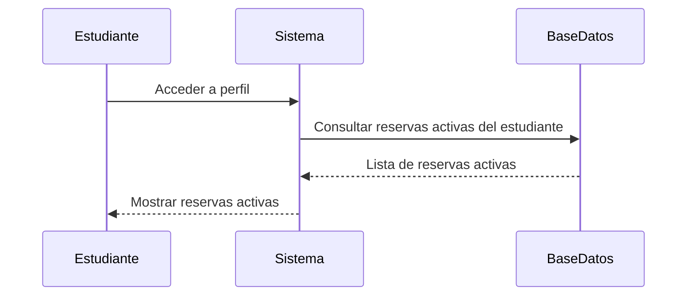
### CA02: Acceso al Historial de Reservas
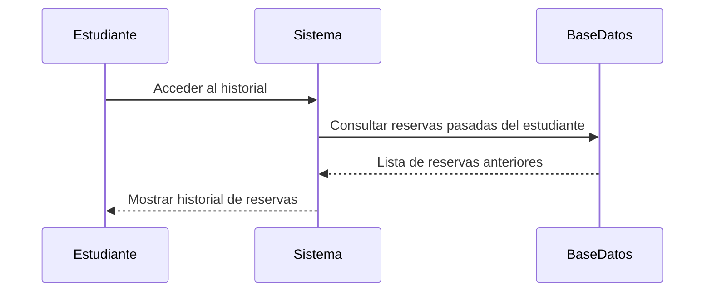
### CA03: Visualización de Detalles
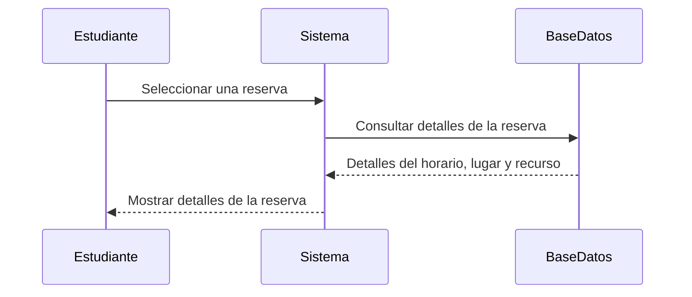
### CA04: Modificación de Reserva
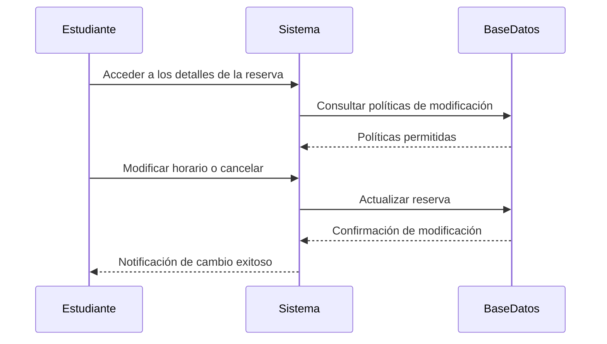
### CA05: Registro de Modificaciones
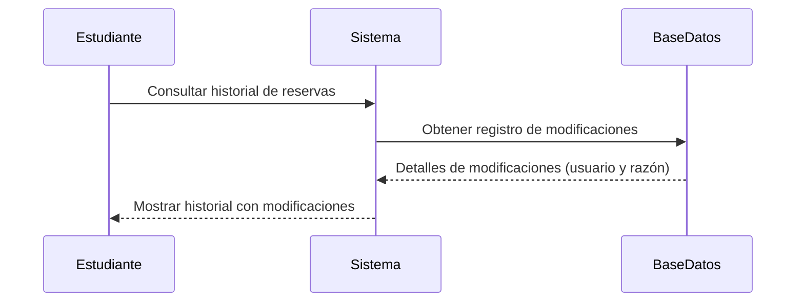
### Criterios de Aceptación No Funcionales
#### Tiempo de Carga
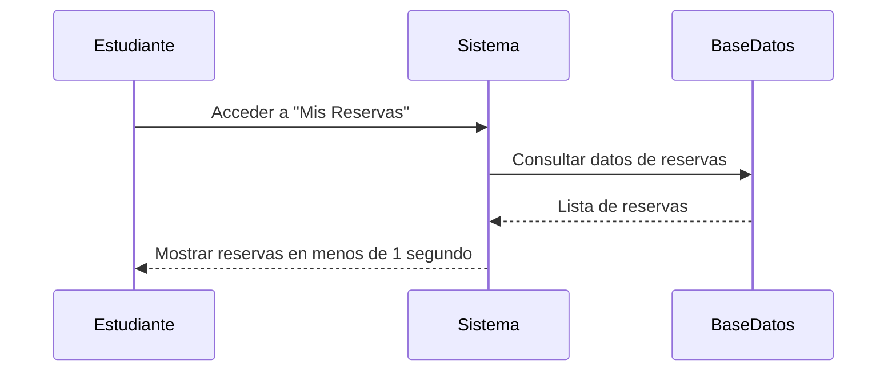
#### Accesibilidad
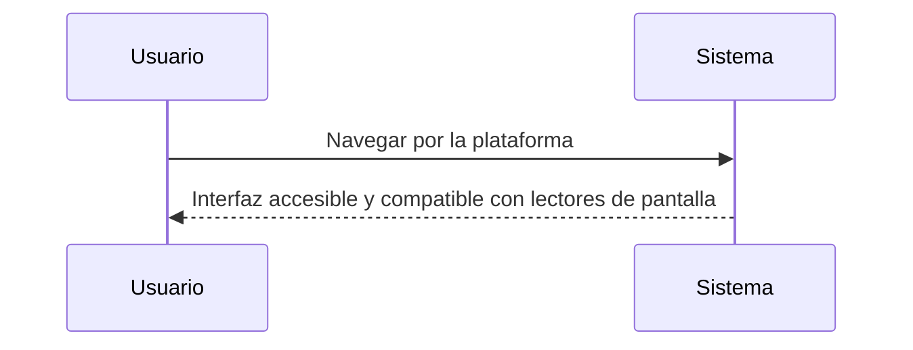

## HU-04
### CA01: Disponibilidad de Computadoras
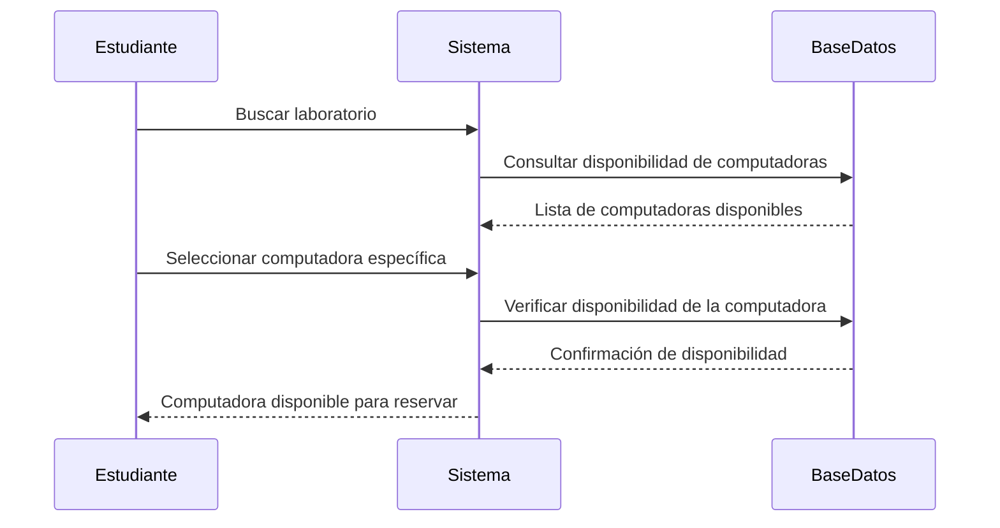

### CA02: Notificación de No Disponibilidad
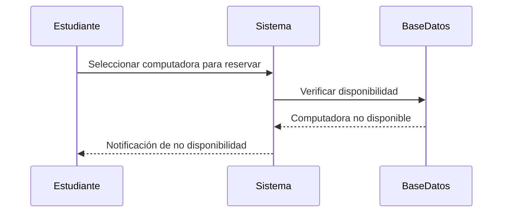
### CA03: Restricción de Doble Reserva
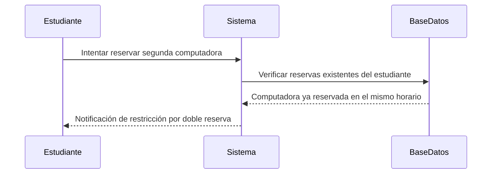
### CA04: Recordatorio de Reserva Próxima
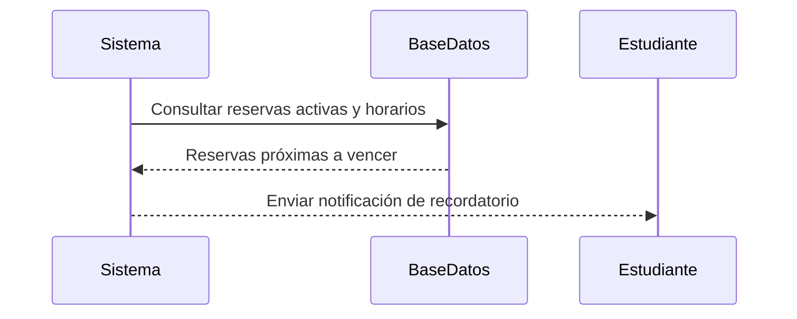
### CA05: Compatibilidad de Software
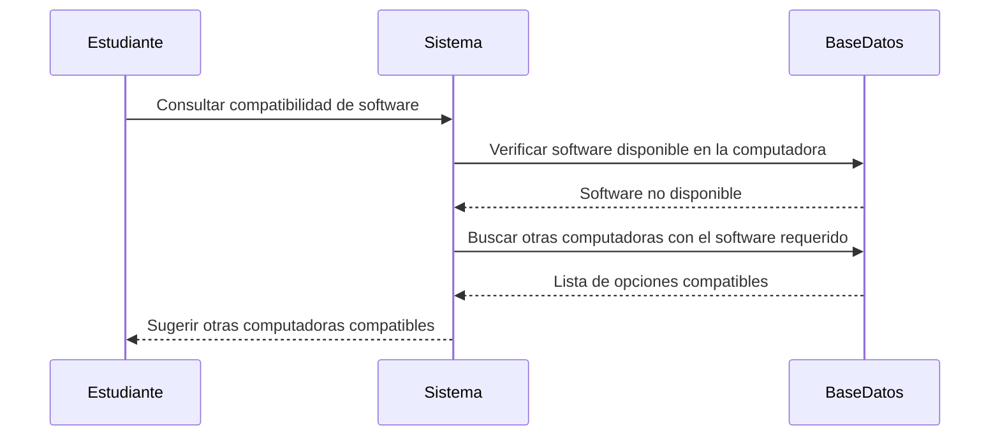
### Criterios de Aceptación No Funcionales

#### Velocidad de Respuesta
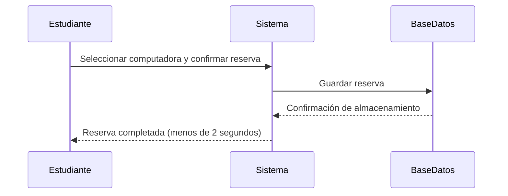
#### Seguridad de Datos
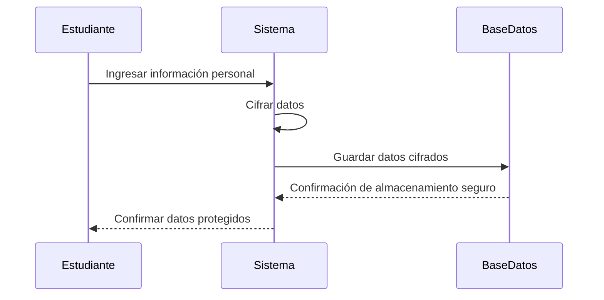

