[](https://classroom.github.com/a/LkahOtWs)
[](https://classroom.github.com/open-in-codespaces?assignment_repo_id=17612975)
# proyecto-formatos-01


# DIAGRAMA DE SECUENCIA
## HU-01
### CA01: Visualización de Reservas Activas
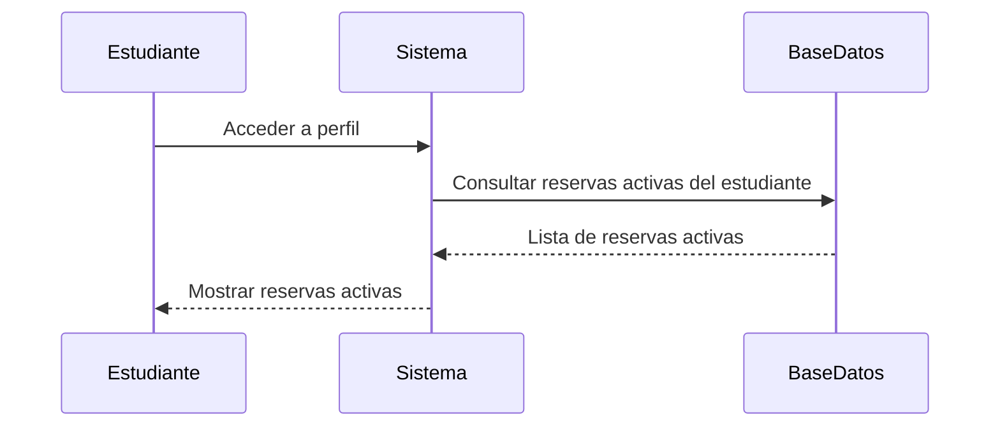
### CA02: Acceso al Historial de Reservas
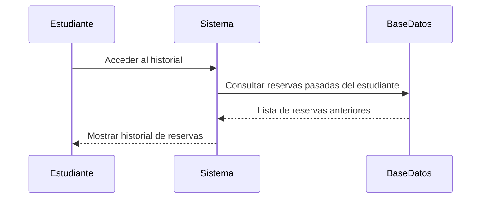
### CA03: Visualización de Detalles
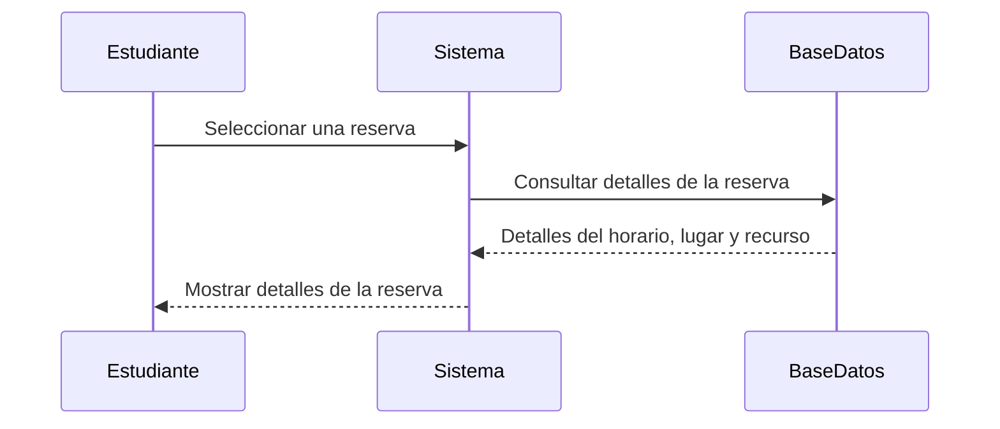
### CA04: Modificación de Reserva
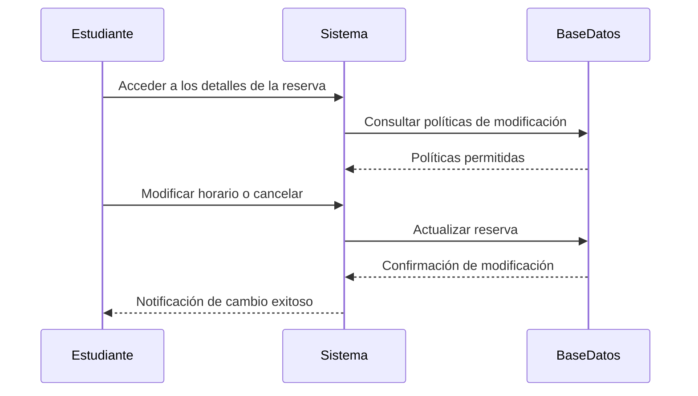
### CA05: Registro de Modificaciones
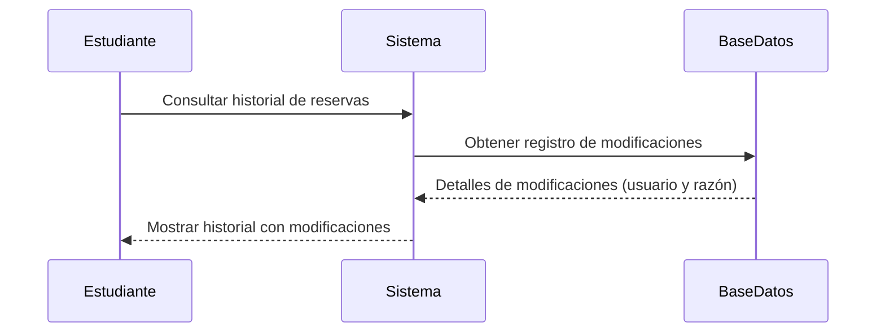
### Criterios de Aceptación No Funcionales
#### Tiempo de Carga
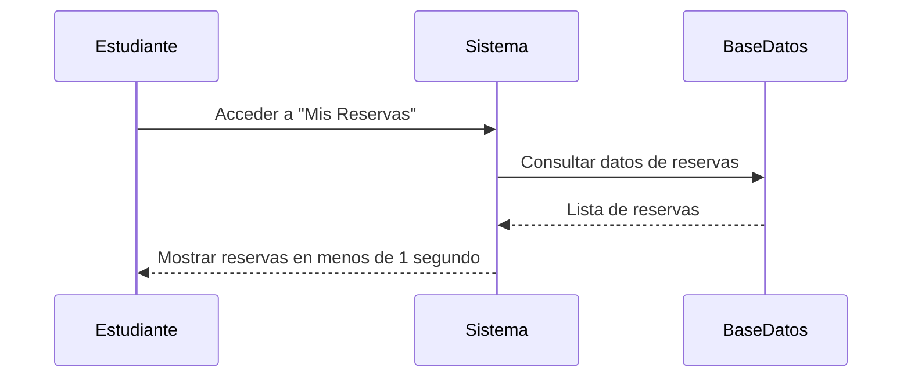
#### Accesibilidad
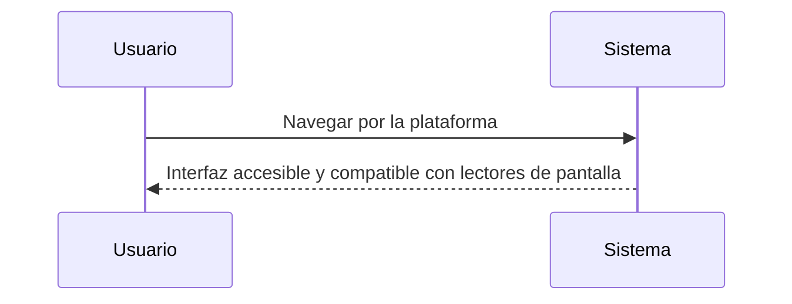
## HU-02
### CA01: Notificación de Recordatorio
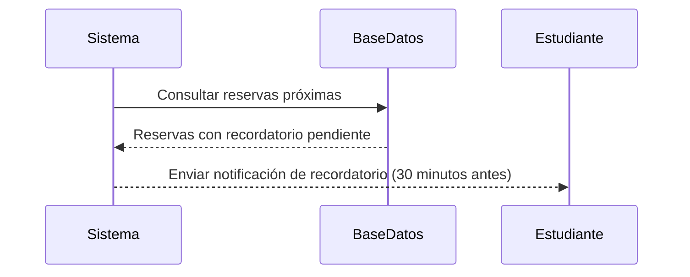
### CA02: Notificación de Cambios
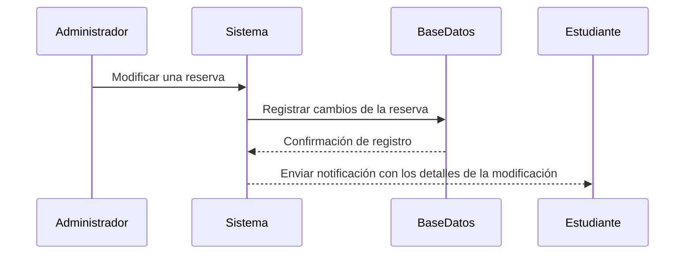
### CA03: Notificación de Cancelación
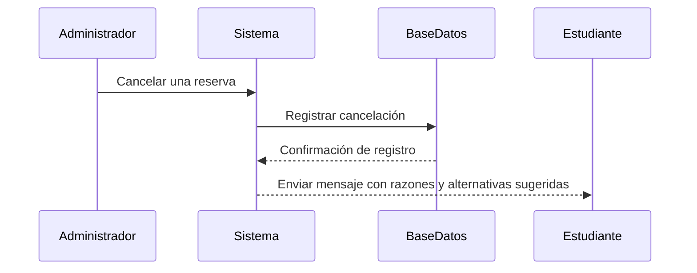
### CA04: Configuración de Notificaciones
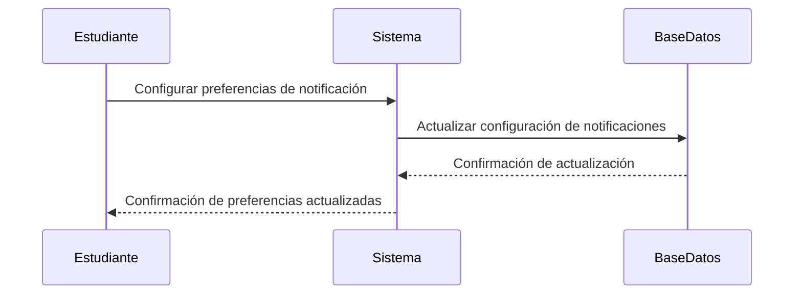
### CA05: Consulta de Notificaciones Pasadas
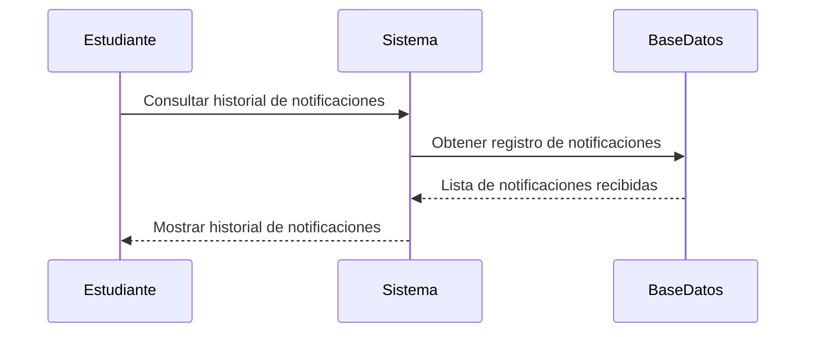
### Criterios de Aceptación No Funcionales

#### Consistencia
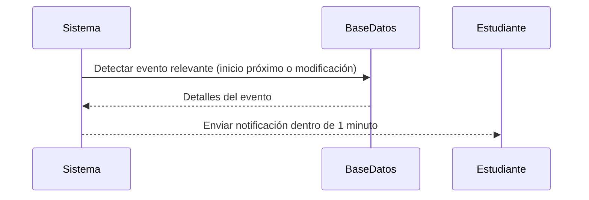
#### Multicanal
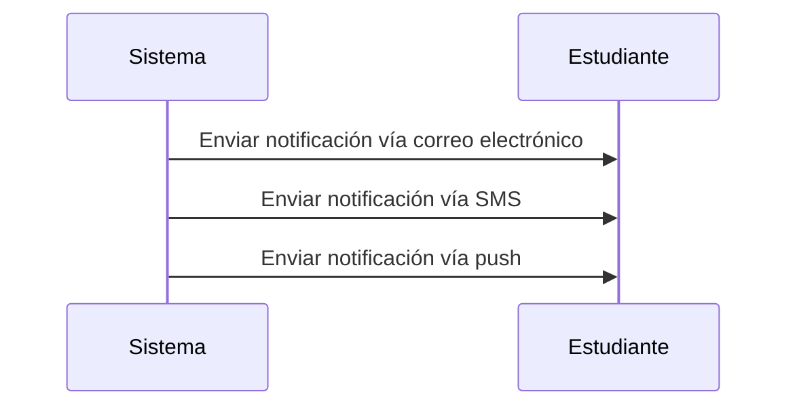
## HU-03
CA01: Búsqueda por Horario
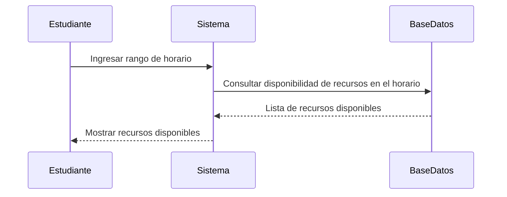
CA02: Filtro por Características
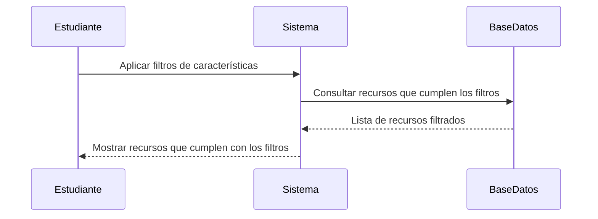
CA03: Notificación de Recursos Ocupados
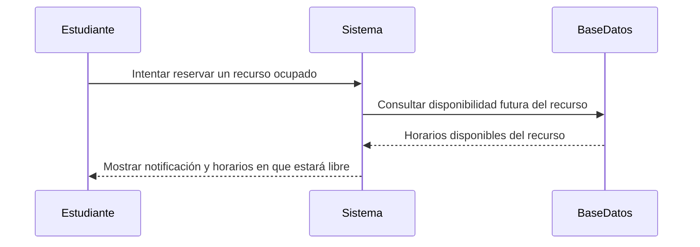
CA04: Consulta de Ocupación Futura
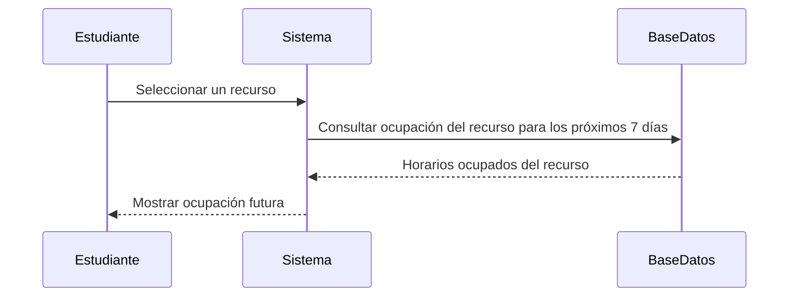
CA05: Compatibilidad con Software Requerido
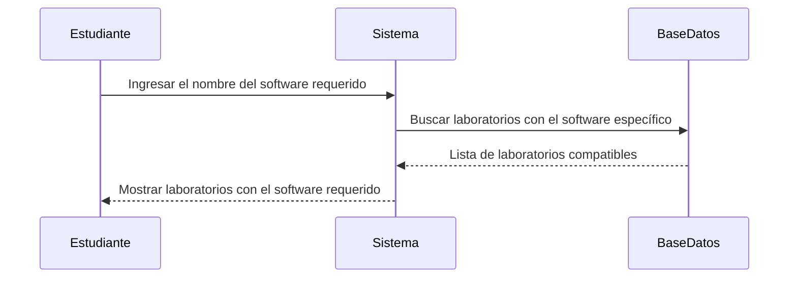
Criterios de Aceptación No Funcionales

Eficiencia en Búsqueda
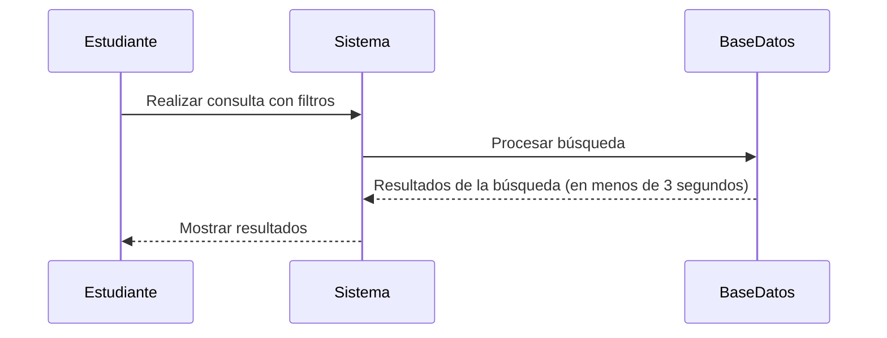
Interfaz Amigable
```mermaid
sequenceDiagram
    participant Estudiante
    participant Sistema

    Estudiante->>Sistema: Interactuar con filtros de búsqueda
    Sistema-->>Estudiante: Mostrar opciones de filtros claros e intuitivos
```
## HU-04
### CA01: Disponibilidad de Computadoras
```mermaid
sequenceDiagram
    participant Estudiante
    participant Sistema
    participant BaseDatos

    Estudiante->>Sistema: Buscar laboratorio
    Sistema->>BaseDatos: Consultar disponibilidad de computadoras
    BaseDatos-->>Sistema: Lista de computadoras disponibles
    Estudiante->>Sistema: Seleccionar computadora específica
    Sistema->>BaseDatos: Verificar disponibilidad de la computadora
    BaseDatos-->>Sistema: Confirmación de disponibilidad
    Sistema-->>Estudiante: Computadora disponible para reservar
```

### CA02: Notificación de No Disponibilidad
```mermaid
sequenceDiagram
    participant Estudiante
    participant Sistema
    participant BaseDatos

    Estudiante->>Sistema: Seleccionar computadora para reservar
    Sistema->>BaseDatos: Verificar disponibilidad
    BaseDatos-->>Sistema: Computadora no disponible
    Sistema-->>Estudiante: Notificación de no disponibilidad
```
### CA03: Restricción de Doble Reserva
```mermaid
sequenceDiagram
    participant Estudiante
    participant Sistema
    participant BaseDatos

    Estudiante->>Sistema: Intentar reservar segunda computadora
    Sistema->>BaseDatos: Verificar reservas existentes del estudiante
    BaseDatos-->>Sistema: Computadora ya reservada en el mismo horario
    Sistema-->>Estudiante: Notificación de restricción por doble reserva
```
### CA04: Recordatorio de Reserva Próxima
```mermaid
sequenceDiagram
    participant Sistema
    participant BaseDatos
    participant Estudiante

    Sistema->>BaseDatos: Consultar reservas activas y horarios
    BaseDatos-->>Sistema: Reservas próximas a vencer
    Sistema-->>Estudiante: Enviar notificación de recordatorio
```
### CA05: Compatibilidad de Software
```mermaid
sequenceDiagram
    participant Estudiante
    participant Sistema
    participant BaseDatos

    Estudiante->>Sistema: Consultar compatibilidad de software
    Sistema->>BaseDatos: Verificar software disponible en la computadora
    BaseDatos-->>Sistema: Software no disponible
    Sistema->>BaseDatos: Buscar otras computadoras con el software requerido
    BaseDatos-->>Sistema: Lista de opciones compatibles
    Sistema-->>Estudiante: Sugerir otras computadoras compatibles
```
### Criterios de Aceptación No Funcionales

#### Velocidad de Respuesta
```mermaid
sequenceDiagram
    participant Estudiante
    participant Sistema
    participant BaseDatos

    Estudiante->>Sistema: Seleccionar computadora y confirmar reserva
    Sistema->>BaseDatos: Guardar reserva
    BaseDatos-->>Sistema: Confirmación de almacenamiento
    Sistema-->>Estudiante: Reserva completada (menos de 2 segundos)
```
#### Seguridad de Datos
```mermaid
sequenceDiagram
    participant Estudiante
    participant Sistema
    participant BaseDatos

    Estudiante->>Sistema: Ingresar información personal
    Sistema->>Sistema: Cifrar datos
    Sistema->>BaseDatos: Guardar datos cifrados
    BaseDatos-->>Sistema: Confirmación de almacenamiento seguro
    Sistema-->>Estudiante: Confirmar datos protegidos
```
## HU-07

### CA01: Asignación de Computadoras Específicas
```mermaid
sequenceDiagram
    participant Docente
    participant Sistema
    participant BaseDatos

    Docente->>Sistema: Seleccionar aula completa reservada
    Sistema->>BaseDatos: Obtener lista de recursos del aula
    BaseDatos-->>Sistema: Lista de computadoras disponibles
    Docente->>Sistema: Asignar computadoras a estudiantes
    Sistema->>BaseDatos: Guardar asignaciones realizadas
    BaseDatos-->>Sistema: Confirmación de asignación
```
### CA02: Modificación de Asignaciones
```mermaid
sequenceDiagram
    participant Docente
    participant Sistema
    participant BaseDatos

    Docente->>Sistema: Acceder a asignaciones realizadas
    Sistema->>BaseDatos: Consultar asignaciones actuales
    BaseDatos-->>Sistema: Detalles de las asignaciones
    Docente->>Sistema: Modificar asignaciones
    Sistema->>BaseDatos: Actualizar datos de asignación
    BaseDatos-->>Sistema: Confirmación de actualización
```
### CA03: Verificación de Disponibilidad
```mermaid
sequenceDiagram
    participant Docente
    participant Sistema
    participant BaseDatos

    Docente->>Sistema: Asignar recursos para la clase
    Sistema->>BaseDatos: Consultar disponibilidad de los recursos seleccionados
    BaseDatos-->>Sistema: Estado de disponibilidad (ocupado o libre)
    Sistema-->>Docente: Notificar si algún recurso no está disponible
```
### CA04: Liberación de Recursos No Utilizados
```mermaid
sequenceDiagram
    participant Docente
    participant Sistema
    participant BaseDatos

    Docente->>Sistema: Seleccionar recursos no utilizados
    Sistema->>BaseDatos: Marcar recursos como liberados
    BaseDatos-->>Sistema: Confirmación de liberación
    Sistema-->>Docente: Recursos liberados correctamente
```
### CA05: Reporte de Asignaciones
```mermaid
sequenceDiagram
    participant Docente
    participant Sistema
    participant BaseDatos

    Docente->>Sistema: Acceder a la reserva
    Sistema->>BaseDatos: Consultar reporte de asignaciones
    BaseDatos-->>Sistema: Detalles de recursos asignados
    Sistema-->>Docente: Mostrar reporte detallado
```
### Criterios de Aceptación No Funcionales

#### Persistencia de Datos
```mermaid
sequenceDiagram
    participant Docente
    participant Sistema
    participant BaseDatos

    Docente->>Sistema: Guardar asignaciones de recursos
    Sistema->>BaseDatos: Registrar asignaciones en tiempo real
    BaseDatos-->>Sistema: Confirmación de datos almacenados sin pérdida
```
#### Interfaz Adaptable
```mermaid
sequenceDiagram
    participant Docente
    participant Sistema

    Docente->>Sistema: Acceder desde un dispositivo (PC, móvil, tableta)
    Sistema-->>Docente: Mostrar funcionalidad optimizada para el dispositivo utilizado
```
## HU-09
CA01: Reporte por Periodo
sequenceDiagram
    participant Administrador
    participant Sistema
    participant BaseDatos

    Administrador->>Sistema: Ingresar rango de fechas
    Sistema->>BaseDatos: Consultar datos de uso en el periodo seleccionado
    BaseDatos-->>Sistema: Datos de ocupación y uso
    Sistema-->>Administrador: Generar y mostrar reporte detallado

CA02: Reporte por Recurso
sequenceDiagram
    participant Administrador
    participant Sistema
    participant BaseDatos

    Administrador->>Sistema: Seleccionar aula o laboratorio
    Sistema->>BaseDatos: Consultar ocupación y disponibilidad histórica del recurso
    BaseDatos-->>Sistema: Datos históricos del recurso
    Sistema-->>Administrador: Mostrar reporte de uso del recurso

CA03: Exportación de Reportes
sequenceDiagram
    participant Administrador
    participant Sistema
    participant BaseDatos

    Administrador->>Sistema: Generar reporte y seleccionar formato (PDF o Excel)
    Sistema->>BaseDatos: Preparar datos para exportación
    BaseDatos-->>Sistema: Confirmación de datos procesados
    Sistema-->>Administrador: Descargar archivo exportado

CA04: Visualización Gráfica
sequenceDiagram
    participant Administrador
    participant Sistema
    participant BaseDatos

    Administrador->>Sistema: Generar reporte con visualización gráfica
    Sistema->>BaseDatos: Consultar datos para gráficos
    BaseDatos-->>Sistema: Datos agregados por hora, día y semana
    Sistema-->>Administrador: Mostrar gráficos junto con el reporte

CA05: Comparación entre Periodos
sequenceDiagram
    participant Administrador
    participant Sistema
    participant BaseDatos

    Administrador->>Sistema: Seleccionar dos periodos para comparar
    Sistema->>BaseDatos: Consultar datos de uso para ambos periodos
    BaseDatos-->>Sistema: Datos de los dos periodos seleccionados
    Sistema-->>Administrador: Mostrar reporte comparativo con diferencias de uso

Criterios de Aceptación No Funcionales

Rapidez
sequenceDiagram
    participant Administrador
    participant Sistema
    participant BaseDatos

    Administrador->>Sistema: Seleccionar rango de fechas y tipo de reporte
    Sistema->>BaseDatos: Procesar datos para el reporte
    BaseDatos-->>Sistema: Datos procesados en menos de 5 segundos
    Sistema-->>Administrador: Mostrar reporte generado

Exportación Segura
sequenceDiagram
    participant Administrador
    participant Sistema
    participant BaseDatos

    Administrador->>Sistema: Exportar reporte en formato PDF o Excel
    Sistema->>BaseDatos: Generar archivo con datos cifrados
    BaseDatos-->>Sistema: Confirmación de archivo seguro
    Sistema-->>Administrador: Descargar archivo cifrado
_____
HU-05
_____

CA01: Reserva de Aula Disponible
sequenceDiagram
    participant Docente
    participant Sistema
    participant BaseDatos

    Docente->>Sistema: Buscar aula para un horario específico
    Sistema->>BaseDatos: Consultar disponibilidad de aulas en el horario
    BaseDatos-->>Sistema: Lista de aulas disponibles
    Docente->>Sistema: Reservar aula seleccionada
    Sistema->>BaseDatos: Guardar reserva
    BaseDatos-->>Sistema: Confirmación de reserva
    Sistema-->>Docente: Aula reservada correctamente

CA02: Notificación de Conflicto de Horario
sequenceDiagram
    participant Docente
    participant Sistema
    participant BaseDatos

    Docente->>Sistema: Intentar reservar aula
    Sistema->>BaseDatos: Verificar disponibilidad en el horario
    BaseDatos-->>Sistema: Conflicto detectado (aula ocupada)
    Sistema-->>Docente: Notificar que el aula no está disponible

CA03: Filtro por Requisitos
sequenceDiagram
    participant Docente
    participant Sistema
    participant BaseDatos

    Docente->>Sistema: Indicar requisitos (proyector, equipo de audio, etc.)
    Sistema->>BaseDatos: Filtrar aulas que cumplen con los requisitos
    BaseDatos-->>Sistema: Lista de aulas filtradas
    Sistema-->>Docente: Mostrar opciones disponibles

CA04: Cancelación de Reserva
sequenceDiagram
    participant Docente
    participant Sistema
    participant BaseDatos

    Docente->>Sistema: Seleccionar reserva para cancelar
    Sistema->>BaseDatos: Verificar estado de la reserva
    BaseDatos-->>Sistema: Reserva no está en curso (cancelable)
    Sistema->>BaseDatos: Marcar reserva como cancelada
    BaseDatos-->>Sistema: Confirmación de cancelación
    Sistema-->>Docente: Reserva cancelada exitosamente

CA05: Alternativa por Mantenimiento
sequenceDiagram
    participant Sistema
    participant BaseDatos
    participant Docente

    Sistema->>BaseDatos: Detectar aula en mantenimiento
    BaseDatos-->>Sistema: Confirmación de conflicto por mantenimiento
    Sistema->>BaseDatos: Buscar alternativas disponibles
    BaseDatos-->>Sistema: Lista de aulas alternativas
    Sistema-->>Docente: Notificar alternativas disponibles

Criterios de Aceptación No Funcionales
Alta Disponibilidad
sequenceDiagram
    participant Docente
    participant Sistema
    participant Monitor

    Docente->>Sistema: Realizar reserva durante horas pico
    Sistema->>Monitor: Verificar estado de tiempo de actividad
    Monitor-->>Sistema: Garantía de 99.9% de disponibilidad
    Sistema-->>Docente: Operación realizada con éxito

Compatibilidad Móvil
sequenceDiagram
    participant Docente
    participant Sistema

    Docente->>Sistema: Acceder desde dispositivo móvil
    Sistema-->>Docente: Interfaz completamente funcional en móvil

_____
HU-06
_____

CA01: Visualización de Reservas
sequenceDiagram
    participant Docente
    participant Sistema
    participant BaseDatos

    Docente->>Sistema: Acceder al sistema e ingresar al módulo de reservas
    Sistema->>BaseDatos: Consultar reservas activas, pasadas y futuras
    BaseDatos-->>Sistema: Enviar detalles de reservas
    Sistema-->>Docente: Mostrar lista de reservas

CA02: Edición o Eliminación de Reservas Conflictivas
sequenceDiagram
    participant Docente
    participant Sistema
    participant BaseDatos
    participant Usuario

    Docente->>Sistema: Editar o eliminar reserva conflictiva
    Sistema->>BaseDatos: Actualizar datos de la reserva
    BaseDatos-->>Sistema: Confirmación de cambio
    Sistema->>Usuario: Notificar a los usuarios afectados
    Sistema-->>Docente: Cambios realizados exitosamente

CA03: Bloqueo de Recursos Fuera de Servicio
sequenceDiagram
    participant Docente
    participant Sistema
    participant BaseDatos

    Docente->>Sistema: Marcar recurso como fuera de servicio
    Sistema->>BaseDatos: Actualizar estado del recurso a “No disponible”
    BaseDatos-->>Sistema: Confirmación de bloqueo
    Sistema-->>Docente: Recurso marcado como fuera de servicio

CA04: Marcado de Reservas No Utilizadas
sequenceDiagram
    participant Sistema
    participant BaseDatos

    Sistema->>BaseDatos: Verificar reservas expiradas sin uso
    BaseDatos-->>Sistema: Lista de reservas no utilizadas
    Sistema->>BaseDatos: Marcar reservas como “No utilizadas”
    BaseDatos-->>Sistema: Confirmación de registro del evento

CA05: Aplicación de Políticas de Prioridad
sequenceDiagram
    participant Docente
    participant Sistema
    participant BaseDatos

    Docente->>Sistema: Configurar políticas de prioridad
    Sistema->>BaseDatos: Guardar políticas configuradas
    BaseDatos-->>Sistema: Confirmación de políticas guardadas
    Sistema-->>Docente: Políticas aplicadas exitosamente
    Sistema->>BaseDatos: Aplicar políticas durante reservas en alta demanda

Criterios de Aceptación No Funcionales
Escalabilidad
sequenceDiagram
    participant Sistema
    participant BaseDatos

    Sistema->>BaseDatos: Manejar 500 reservas simultáneas
    BaseDatos-->>Sistema: Procesar solicitudes sin retrasos
    Sistema-->>Sistema: Mantener rendimiento óptimo

Auditoría
sequenceDiagram
    participant Administrador
    participant Sistema
    participant BaseDatos

    Administrador->>Sistema: Editar, eliminar o bloquear recurso
    Sistema->>BaseDatos: Registrar acción con fecha, hora y usuario
    BaseDatos-->>Sistema: Confirmación de registro
    Sistema-->>Administrador: Acción registrada exitosamente

_____
HU-08
_____
CA01: Autenticación de Usuarios
sequenceDiagram
    participant Usuario
    participant Sistema
    participant BaseDatos

    Usuario->>Sistema: Ingresar código universitario
    Sistema->>BaseDatos: Verificar identidad del usuario
    BaseDatos-->>Sistema: Confirmación de identidad
    Sistema-->>Usuario: Acceso permitido

CA02: Gestión de Roles
sequenceDiagram
    participant Administrador
    participant Sistema
    participant BaseDatos

    Administrador->>Sistema: Configurar roles de usuario
    Sistema->>BaseDatos: Actualizar asignaciones de roles
    BaseDatos-->>Sistema: Confirmación de actualización
    Sistema-->>Administrador: Roles y permisos asignados correctamente

CA03: Restricción de Accesos No Autorizados
sequenceDiagram
    participant Usuario
    participant Sistema
    participant BaseDatos

    Usuario->>Sistema: Intentar reservar recurso restringido
    Sistema->>BaseDatos: Verificar permisos del usuario
    BaseDatos-->>Sistema: Acceso denegado (sin permisos)
    Sistema-->>Usuario: Bloquear acción y notificar

CA04: Asignación de Permisos Especiales
sequenceDiagram
    participant Administrador
    participant Sistema
    participant BaseDatos

    Administrador->>Sistema: Otorgar permisos adicionales a un usuario
    Sistema->>BaseDatos: Actualizar permisos del usuario
    BaseDatos-->>Sistema: Confirmación de actualización
    Sistema-->>Administrador: Permisos reflejados de inmediato

CA05: Revocación de Permisos
sequenceDiagram
    participant Administrador
    participant Sistema
    participant BaseDatos

    Administrador->>Sistema: Eliminar permisos de un usuario
    Sistema->>BaseDatos: Revocar acceso del usuario
    BaseDatos-->>Sistema: Confirmación de revocación
    Sistema-->>Administrador: Acceso restringido correctamente

Criterios de Aceptación No Funcionales

Seguridad
sequenceDiagram
    participant Usuario
    participant Sistema

    Usuario->>Sistema: Ingresar credenciales
    Sistema->>Sistema: Cifrar datos sensibles en tránsito y reposo
    Sistema-->>Usuario: Proceso de autenticación seguro

Fiabilidad
sequenceDiagram
    participant Usuario
    participant Sistema

    Usuario->>Sistema: Intentar acceder al sistema con credenciales correctas
    Sistema-->>Usuario: Autenticación exitosa (99.95% tasa de éxito)
_____
HU-10
_____
CA01: Inicio de Sesión con SSO
sequenceDiagram
    participant Usuario
    participant Sistema
    participant SSO

    Usuario->>Sistema: Intentar acceder al sistema
    Sistema->>Usuario: Seleccionar inicio de sesión con cuenta universitaria
    Usuario->>SSO: Autenticación a través de SSO
    SSO-->>Sistema: Confirmación de autenticación
    Sistema-->>Usuario: Acceso permitido

CA02: Sincronización de Datos
sequenceDiagram
    participant Usuario
    participant Sistema
    participant BaseDatos

    Usuario->>Sistema: Realizar acción (reserva o consulta)
    Sistema->>BaseDatos: Sincronizar información del usuario
    BaseDatos-->>Sistema: Confirmación de sincronización
    Sistema-->>Usuario: Acción completada con datos actualizados

CA03: Notificación de Errores de Autenticación
sequenceDiagram
    participant Usuario
    participant Sistema
    participant SSO

    Usuario->>Sistema: Intentar iniciar sesión
    Sistema->>SSO: Verificar cuenta activa
    SSO-->>Sistema: Cuenta no activa
    Sistema-->>Usuario: Notificar error y sugerir pasos para solucionar

CA04: Acceso Simultáneo Restringido
sequenceDiagram
    participant Usuario
    participant Sistema
    participant SSO

    Usuario->>Sistema: Intentar iniciar sesión en otro dispositivo
    Sistema->>SSO: Verificar autenticación previa
    SSO-->>Sistema: Autenticación ya activa en otro dispositivo
    Sistema-->>Usuario: Impedir acceso simultáneo no permitido

CA05: Desvinculación de Cuentas
sequenceDiagram
    participant Usuario
    participant Sistema
    participant SSO

    Usuario->>Sistema: Solicitar desvinculación de cuenta
    Sistema->>SSO: Procesar desvinculación
    SSO-->>Sistema: Confirmación de desvinculación
    Sistema-->>Usuario: Cuenta desvinculada sin afectar cuenta universitaria

Criterios de Aceptación No Funcionales

Confiabilidad
sequenceDiagram
    participant Usuario
    participant Sistema

    Usuario->>Sistema: Intentar iniciar sesión con SSO
    Sistema-->>Usuario: Proceso de autenticación
    Note right of Sistema: Garantizar disponibilidad del 99.9%

Compatibilidad
sequenceDiagram
    participant Usuario
    participant Sistema
    participant SSO

    Usuario->>Sistema: Intentar autenticarse
    Sistema->>SSO: Verificar compatibilidad
    SSO-->>Sistema: Autenticación exitosa (compatible)
    Sistema-->>Usuario: Acceso permitido

