[](https://classroom.github.com/a/LkahOtWs)
[](https://classroom.github.com/open-in-codespaces?assignment_repo_id=17612975)
# proyecto-formatos-01

# DIAGRAMA DE CASO DE USO

## HU-01


## HU-02


## HU-03


## HU-04


## HU-05


## HU-06


## HU-07


## HU-08


## HU-09


## HU-10


# DIAGRAMA DE SECUENCIA
## HU-01
### CA01: Visualización de Reservas Activas
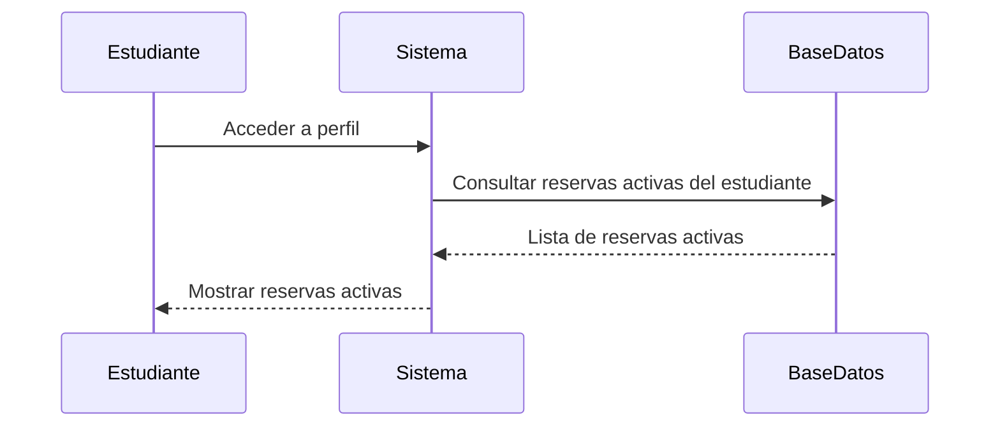
### CA02: Acceso al Historial de Reservas
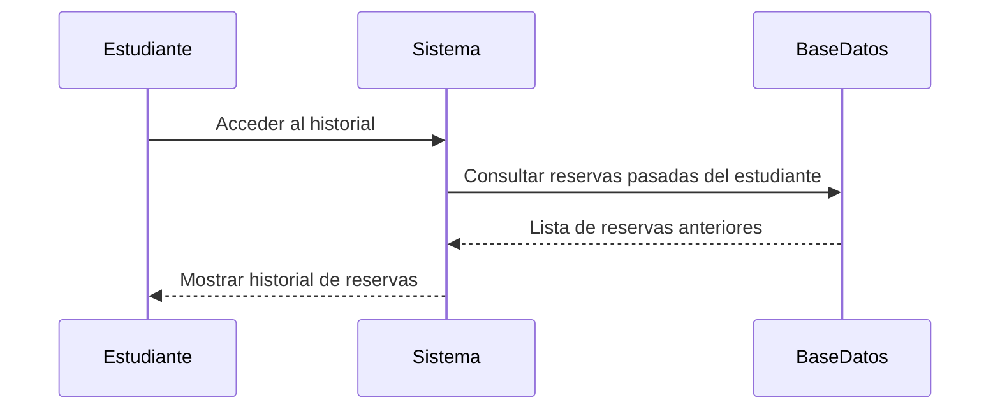
### CA03: Visualización de Detalles
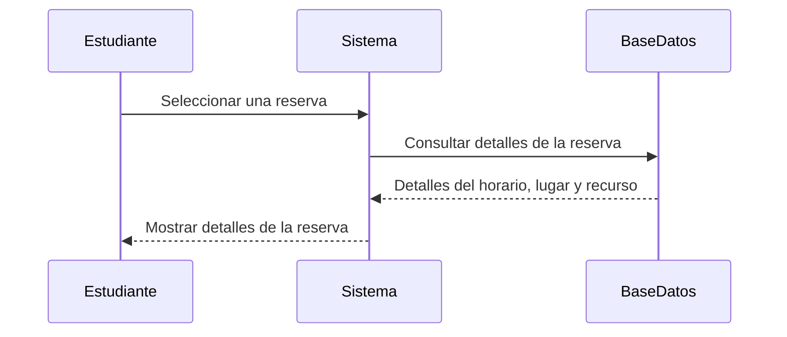
### CA04: Modificación de Reserva
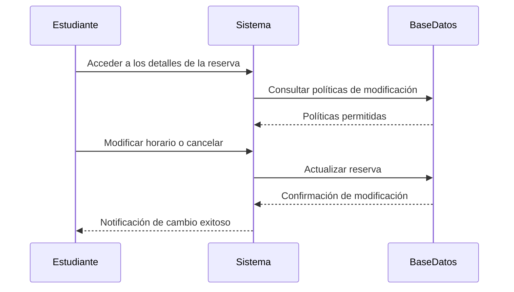
### CA05: Registro de Modificaciones
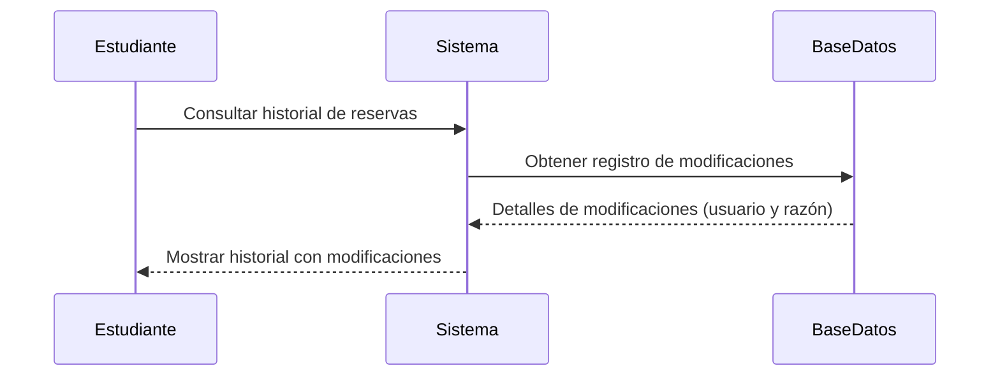
### Criterios de Aceptación No Funcionales
#### Tiempo de Carga
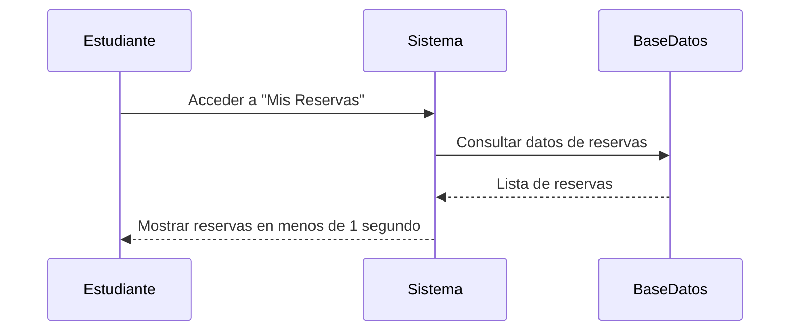
#### Accesibilidad
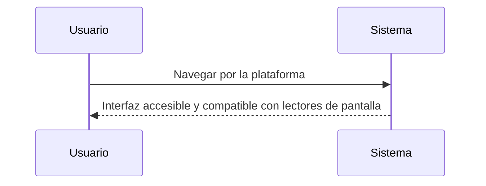
## HU-02
### CA01: Notificación de Recordatorio
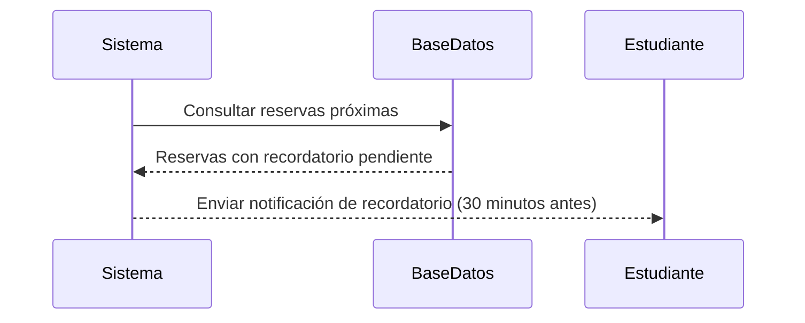
### CA02: Notificación de Cambios
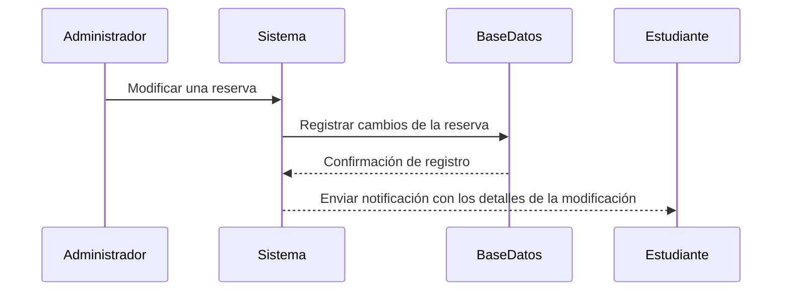
### CA03: Notificación de Cancelación
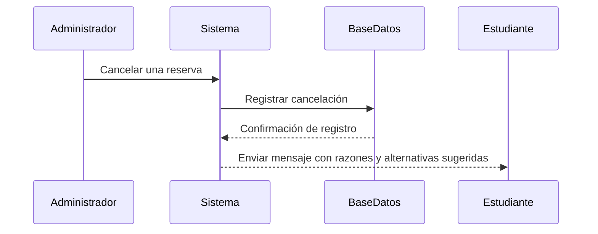
### CA04: Configuración de Notificaciones
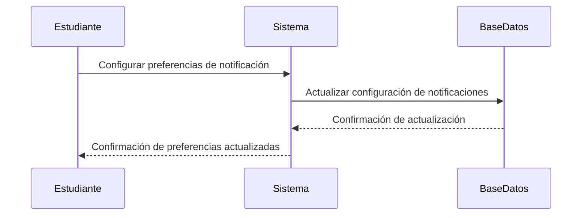
### CA05: Consulta de Notificaciones Pasadas
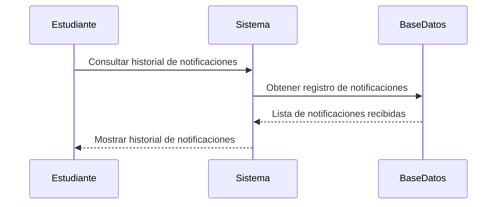
### Criterios de Aceptación No Funcionales

#### Consistencia
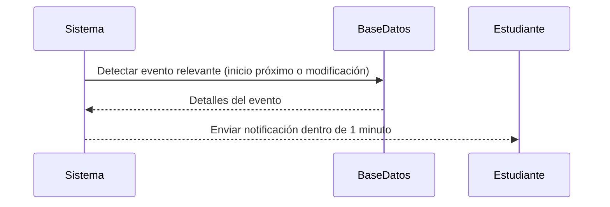
#### Multicanal
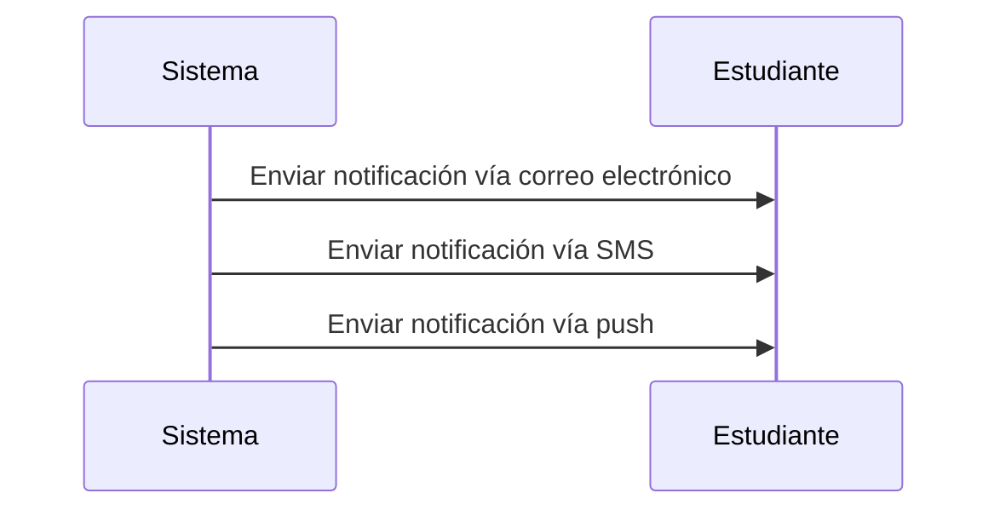
## HU-03
CA01: Búsqueda por Horario
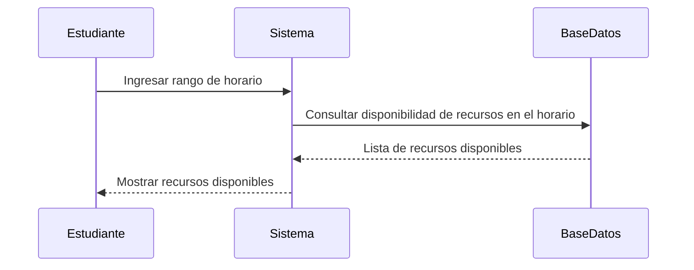
CA02: Filtro por Características
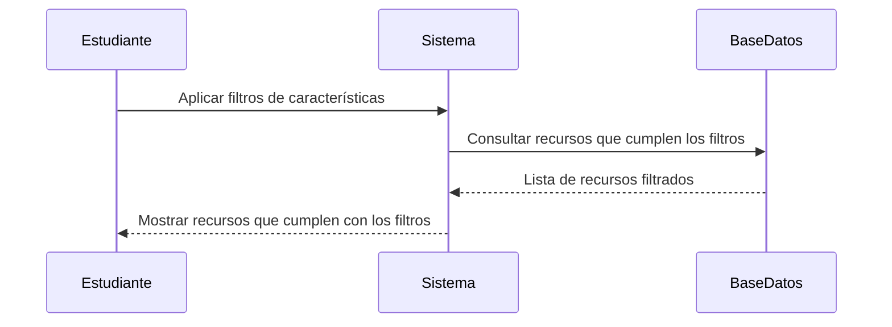
CA03: Notificación de Recursos Ocupados
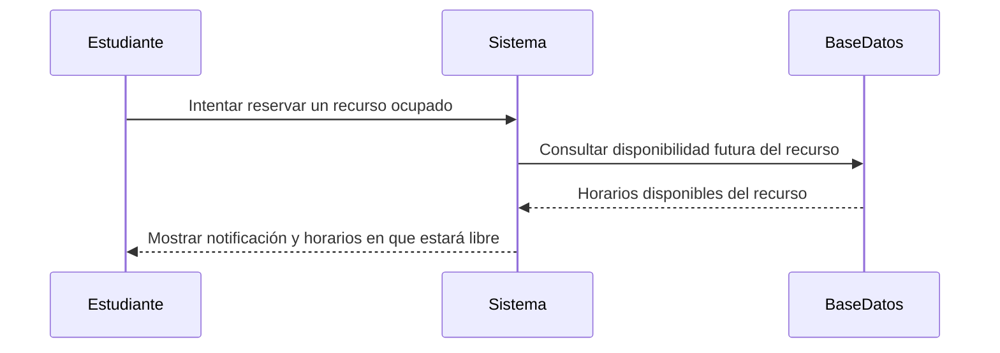
CA04: Consulta de Ocupación Futura
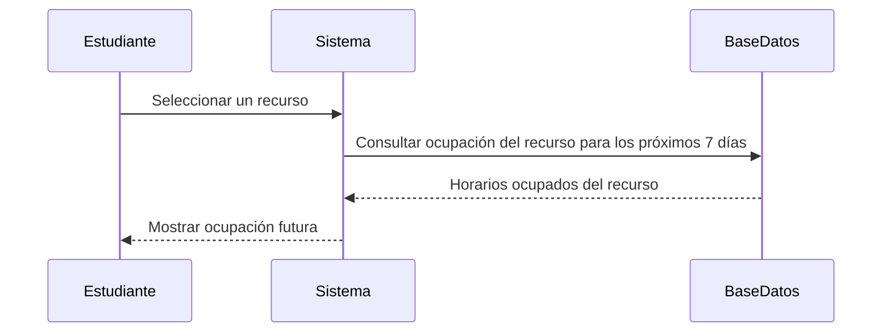
CA05: Compatibilidad con Software Requerido
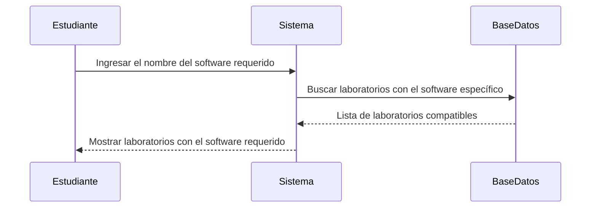
Criterios de Aceptación No Funcionales

Eficiencia en Búsqueda
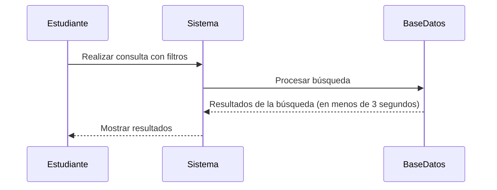
Interfaz Amigable
```mermaid
sequenceDiagram
    participant Estudiante
    participant Sistema

    Estudiante->>Sistema: Interactuar con filtros de búsqueda
    Sistema-->>Estudiante: Mostrar opciones de filtros claros e intuitivos
```
## HU-04
### CA01: Disponibilidad de Computadoras
```mermaid
sequenceDiagram
    participant Estudiante
    participant Sistema
    participant BaseDatos

    Estudiante->>Sistema: Buscar laboratorio
    Sistema->>BaseDatos: Consultar disponibilidad de computadoras
    BaseDatos-->>Sistema: Lista de computadoras disponibles
    Estudiante->>Sistema: Seleccionar computadora específica
    Sistema->>BaseDatos: Verificar disponibilidad de la computadora
    BaseDatos-->>Sistema: Confirmación de disponibilidad
    Sistema-->>Estudiante: Computadora disponible para reservar
```

### CA02: Notificación de No Disponibilidad
```mermaid
sequenceDiagram
    participant Estudiante
    participant Sistema
    participant BaseDatos

    Estudiante->>Sistema: Seleccionar computadora para reservar
    Sistema->>BaseDatos: Verificar disponibilidad
    BaseDatos-->>Sistema: Computadora no disponible
    Sistema-->>Estudiante: Notificación de no disponibilidad
```
### CA03: Restricción de Doble Reserva
```mermaid
sequenceDiagram
    participant Estudiante
    participant Sistema
    participant BaseDatos

    Estudiante->>Sistema: Intentar reservar segunda computadora
    Sistema->>BaseDatos: Verificar reservas existentes del estudiante
    BaseDatos-->>Sistema: Computadora ya reservada en el mismo horario
    Sistema-->>Estudiante: Notificación de restricción por doble reserva
```
### CA04: Recordatorio de Reserva Próxima
```mermaid
sequenceDiagram
    participant Sistema
    participant BaseDatos
    participant Estudiante

    Sistema->>BaseDatos: Consultar reservas activas y horarios
    BaseDatos-->>Sistema: Reservas próximas a vencer
    Sistema-->>Estudiante: Enviar notificación de recordatorio
```
### CA05: Compatibilidad de Software
```mermaid
sequenceDiagram
    participant Estudiante
    participant Sistema
    participant BaseDatos

    Estudiante->>Sistema: Consultar compatibilidad de software
    Sistema->>BaseDatos: Verificar software disponible en la computadora
    BaseDatos-->>Sistema: Software no disponible
    Sistema->>BaseDatos: Buscar otras computadoras con el software requerido
    BaseDatos-->>Sistema: Lista de opciones compatibles
    Sistema-->>Estudiante: Sugerir otras computadoras compatibles
```
### Criterios de Aceptación No Funcionales

#### Velocidad de Respuesta
```mermaid
sequenceDiagram
    participant Estudiante
    participant Sistema
    participant BaseDatos

    Estudiante->>Sistema: Seleccionar computadora y confirmar reserva
    Sistema->>BaseDatos: Guardar reserva
    BaseDatos-->>Sistema: Confirmación de almacenamiento
    Sistema-->>Estudiante: Reserva completada (menos de 2 segundos)
```
#### Seguridad de Datos
```mermaid
sequenceDiagram
    participant Estudiante
    participant Sistema
    participant BaseDatos

    Estudiante->>Sistema: Ingresar información personal
    Sistema->>Sistema: Cifrar datos
    Sistema->>BaseDatos: Guardar datos cifrados
    BaseDatos-->>Sistema: Confirmación de almacenamiento seguro
    Sistema-->>Estudiante: Confirmar datos protegidos
```

## HU-05

### CA01: Reserva de Aula Disponible
```mermaid
sequenceDiagram
    participant Docente
    participant Sistema
    participant BaseDatos

    Docente->>Sistema: Buscar aula para un horario específico
    Sistema->>BaseDatos: Consultar disponibilidad de aulas en el horario
    BaseDatos-->>Sistema: Lista de aulas disponibles
    Docente->>Sistema: Reservar aula seleccionada
    Sistema->>BaseDatos: Guardar reserva
    BaseDatos-->>Sistema: Confirmación de reserva
    Sistema-->>Docente: Aula reservada correctamente
```
### CA02: Notificación de Conflicto de Horario
```mermaid
sequenceDiagram
    participant Docente
    participant Sistema
    participant BaseDatos

    Docente->>Sistema: Intentar reservar aula
    Sistema->>BaseDatos: Verificar disponibilidad en el horario
    BaseDatos-->>Sistema: Conflicto detectado (aula ocupada)
    Sistema-->>Docente: Notificar que el aula no está disponible
```
### CA03: Filtro por Requisitos
```mermaid
sequenceDiagram
    participant Docente
    participant Sistema
    participant BaseDatos

    Docente->>Sistema: Indicar requisitos (proyector, equipo de audio, etc.)
    Sistema->>BaseDatos: Filtrar aulas que cumplen con los requisitos
    BaseDatos-->>Sistema: Lista de aulas filtradas
    Sistema-->>Docente: Mostrar opciones disponibles
```
### CA04: Cancelación de Reserva
```mermaid
sequenceDiagram
    participant Docente
    participant Sistema
    participant BaseDatos

    Docente->>Sistema: Seleccionar reserva para cancelar
    Sistema->>BaseDatos: Verificar estado de la reserva
    BaseDatos-->>Sistema: Reserva no está en curso (cancelable)
    Sistema->>BaseDatos: Marcar reserva como cancelada
    BaseDatos-->>Sistema: Confirmación de cancelación
    Sistema-->>Docente: Reserva cancelada exitosamente
```
### CA05: Alternativa por Mantenimiento
```mermaid
sequenceDiagram
    participant Sistema
    participant BaseDatos
    participant Docente

    Sistema->>BaseDatos: Detectar aula en mantenimiento
    BaseDatos-->>Sistema: Confirmación de conflicto por mantenimiento
    Sistema->>BaseDatos: Buscar alternativas disponibles
    BaseDatos-->>Sistema: Lista de aulas alternativas
    Sistema-->>Docente: Notificar alternativas disponibles
```
### Criterios de Aceptación No Funcionales
#### Alta Disponibilidad
```mermaid
sequenceDiagram
    participant Docente
    participant Sistema
    participant Monitor

    Docente->>Sistema: Realizar reserva durante horas pico
    Sistema->>Monitor: Verificar estado de tiempo de actividad
    Monitor-->>Sistema: Garantía de 99.9% de disponibilidad
    Sistema-->>Docente: Operación realizada con éxito
```
#### Compatibilidad Móvil
```mermaid
sequenceDiagram
    participant Docente
    participant Sistema

    Docente->>Sistema: Acceder desde dispositivo móvil
    Sistema-->>Docente: Interfaz completamente funcional en móvil
```

## HU-06

### CA01: Visualización de Reservas
```mermaid
sequenceDiagram
    participant Docente
    participant Sistema
    participant BaseDatos

    Docente->>Sistema: Acceder al sistema e ingresar al módulo de reservas
    Sistema->>BaseDatos: Consultar reservas activas, pasadas y futuras
    BaseDatos-->>Sistema: Enviar detalles de reservas
    Sistema-->>Docente: Mostrar lista de reservas
```
### CA02: Edición o Eliminación de Reservas Conflictivas
```mermaid
sequenceDiagram
    participant Docente
    participant Sistema
    participant BaseDatos
    participant Usuario

    Docente->>Sistema: Editar o eliminar reserva conflictiva
    Sistema->>BaseDatos: Actualizar datos de la reserva
    BaseDatos-->>Sistema: Confirmación de cambio
    Sistema->>Usuario: Notificar a los usuarios afectados
    Sistema-->>Docente: Cambios realizados exitosamente
```
### CA03: Bloqueo de Recursos Fuera de Servicio
```mermaid
sequenceDiagram
    participant Docente
    participant Sistema
    participant BaseDatos

    Docente->>Sistema: Marcar recurso como fuera de servicio
    Sistema->>BaseDatos: Actualizar estado del recurso a “No disponible”
    BaseDatos-->>Sistema: Confirmación de bloqueo
    Sistema-->>Docente: Recurso marcado como fuera de servicio
```
### CA04: Marcado de Reservas No Utilizadas
```mermaid
sequenceDiagram
    participant Sistema
    participant BaseDatos

    Sistema->>BaseDatos: Verificar reservas expiradas sin uso
    BaseDatos-->>Sistema: Lista de reservas no utilizadas
    Sistema->>BaseDatos: Marcar reservas como “No utilizadas”
    BaseDatos-->>Sistema: Confirmación de registro del evento
```
### CA05: Aplicación de Políticas de Prioridad
```mermaid
sequenceDiagram
    participant Docente
    participant Sistema
    participant BaseDatos

    Docente->>Sistema: Configurar políticas de prioridad
    Sistema->>BaseDatos: Guardar políticas configuradas
    BaseDatos-->>Sistema: Confirmación de políticas guardadas
    Sistema-->>Docente: Políticas aplicadas exitosamente
    Sistema->>BaseDatos: Aplicar políticas durante reservas en alta demanda
```
### Criterios de Aceptación No Funcionales
#### Escalabilidad
```mermaid
sequenceDiagram
    participant Sistema
    participant BaseDatos

    Sistema->>BaseDatos: Manejar 500 reservas simultáneas
    BaseDatos-->>Sistema: Procesar solicitudes sin retrasos
    Sistema-->>Sistema: Mantener rendimiento óptimo
```
#### Auditoría
```mermaid
sequenceDiagram
    participant Administrador
    participant Sistema
    participant BaseDatos

    Administrador->>Sistema: Editar, eliminar o bloquear recurso
    Sistema->>BaseDatos: Registrar acción con fecha, hora y usuario
    BaseDatos-->>Sistema: Confirmación de registro
    Sistema-->>Administrador: Acción registrada exitosamente
```
## HU-07

### CA01: Asignación de Computadoras Específicas
```mermaid
sequenceDiagram
    participant Docente
    participant Sistema
    participant BaseDatos

    Docente->>Sistema: Seleccionar aula completa reservada
    Sistema->>BaseDatos: Obtener lista de recursos del aula
    BaseDatos-->>Sistema: Lista de computadoras disponibles
    Docente->>Sistema: Asignar computadoras a estudiantes
    Sistema->>BaseDatos: Guardar asignaciones realizadas
    BaseDatos-->>Sistema: Confirmación de asignación
```
### CA02: Modificación de Asignaciones
```mermaid
sequenceDiagram
    participant Docente
    participant Sistema
    participant BaseDatos

    Docente->>Sistema: Acceder a asignaciones realizadas
    Sistema->>BaseDatos: Consultar asignaciones actuales
    BaseDatos-->>Sistema: Detalles de las asignaciones
    Docente->>Sistema: Modificar asignaciones
    Sistema->>BaseDatos: Actualizar datos de asignación
    BaseDatos-->>Sistema: Confirmación de actualización
```
### CA03: Verificación de Disponibilidad
```mermaid
sequenceDiagram
    participant Docente
    participant Sistema
    participant BaseDatos

    Docente->>Sistema: Asignar recursos para la clase
    Sistema->>BaseDatos: Consultar disponibilidad de los recursos seleccionados
    BaseDatos-->>Sistema: Estado de disponibilidad (ocupado o libre)
    Sistema-->>Docente: Notificar si algún recurso no está disponible
```
### CA04: Liberación de Recursos No Utilizados
```mermaid
sequenceDiagram
    participant Docente
    participant Sistema
    participant BaseDatos

    Docente->>Sistema: Seleccionar recursos no utilizados
    Sistema->>BaseDatos: Marcar recursos como liberados
    BaseDatos-->>Sistema: Confirmación de liberación
    Sistema-->>Docente: Recursos liberados correctamente
```
### CA05: Reporte de Asignaciones
```mermaid
sequenceDiagram
    participant Docente
    participant Sistema
    participant BaseDatos

    Docente->>Sistema: Acceder a la reserva
    Sistema->>BaseDatos: Consultar reporte de asignaciones
    BaseDatos-->>Sistema: Detalles de recursos asignados
    Sistema-->>Docente: Mostrar reporte detallado
```
### Criterios de Aceptación No Funcionales

#### Persistencia de Datos
```mermaid
sequenceDiagram
    participant Docente
    participant Sistema
    participant BaseDatos

    Docente->>Sistema: Guardar asignaciones de recursos
    Sistema->>BaseDatos: Registrar asignaciones en tiempo real
    BaseDatos-->>Sistema: Confirmación de datos almacenados sin pérdida
```
#### Interfaz Adaptable
```mermaid
sequenceDiagram
    participant Docente
    participant Sistema

    Docente->>Sistema: Acceder desde un dispositivo (PC, móvil, tableta)
    Sistema-->>Docente: Mostrar funcionalidad optimizada para el dispositivo utilizado
```
## HU-08
### CA01: Autenticación de Usuarios
```mermaid
sequenceDiagram
    participant Usuario
    participant Sistema
    participant BaseDatos

    Usuario->>Sistema: Ingresar código universitario
    Sistema->>BaseDatos: Verificar identidad del usuario
    BaseDatos-->>Sistema: Confirmación de identidad
    Sistema-->>Usuario: Acceso permitido
```
### CA02: Gestión de Roles
```mermaid
sequenceDiagram
    participant Administrador
    participant Sistema
    participant BaseDatos

    Administrador->>Sistema: Configurar roles de usuario
    Sistema->>BaseDatos: Actualizar asignaciones de roles
    BaseDatos-->>Sistema: Confirmación de actualización
    Sistema-->>Administrador: Roles y permisos asignados correctamente
```
### CA03: Restricción de Accesos No Autorizados
```mermaid
sequenceDiagram
    participant Usuario
    participant Sistema
    participant BaseDatos

    Usuario->>Sistema: Intentar reservar recurso restringido
    Sistema->>BaseDatos: Verificar permisos del usuario
    BaseDatos-->>Sistema: Acceso denegado (sin permisos)
    Sistema-->>Usuario: Bloquear acción y notificar
```
### CA04: Asignación de Permisos Especiales
```mermaid
sequenceDiagram
    participant Administrador
    participant Sistema
    participant BaseDatos

    Administrador->>Sistema: Otorgar permisos adicionales a un usuario
    Sistema->>BaseDatos: Actualizar permisos del usuario
    BaseDatos-->>Sistema: Confirmación de actualización
    Sistema-->>Administrador: Permisos reflejados de inmediato
```
### CA05: Revocación de Permisos
```mermaid
sequenceDiagram
    participant Administrador
    participant Sistema
    participant BaseDatos

    Administrador->>Sistema: Eliminar permisos de un usuario
    Sistema->>BaseDatos: Revocar acceso del usuario
    BaseDatos-->>Sistema: Confirmación de revocación
    Sistema-->>Administrador: Acceso restringido correctamente
```
### Criterios de Aceptación No Funcionales

#### Seguridad
```mermaid
sequenceDiagram
    participant Usuario
    participant Sistema

    Usuario->>Sistema: Ingresar credenciales
    Sistema->>Sistema: Cifrar datos sensibles en tránsito y reposo
    Sistema-->>Usuario: Proceso de autenticación seguro
```
#### Fiabilidad
```mermaid
sequenceDiagram
    participant Usuario
    participant Sistema

    Usuario->>Sistema: Intentar acceder al sistema con credenciales correctas
    Sistema-->>Usuario: Autenticación exitosa (99.95% tasa de éxito)
```

## HU-09
### CA01: Reporte por Periodo
```mermaid
sequenceDiagram
    participant Administrador
    participant Sistema
    participant BaseDatos

    Administrador->>Sistema: Ingresar rango de fechas
    Sistema->>BaseDatos: Consultar datos de uso en el periodo seleccionado
    BaseDatos-->>Sistema: Datos de ocupación y uso
    Sistema-->>Administrador: Generar y mostrar reporte detallado
```
### CA02: Reporte por Recurso
```mermaid
sequenceDiagram
    participant Administrador
    participant Sistema
    participant BaseDatos

    Administrador->>Sistema: Seleccionar aula o laboratorio
    Sistema->>BaseDatos: Consultar ocupación y disponibilidad histórica del recurso
    BaseDatos-->>Sistema: Datos históricos del recurso
    Sistema-->>Administrador: Mostrar reporte de uso del recurso
```
### CA03: Exportación de Reportes
```mermaid
sequenceDiagram
    participant Administrador
    participant Sistema
    participant BaseDatos

    Administrador->>Sistema: Generar reporte y seleccionar formato (PDF o Excel)
    Sistema->>BaseDatos: Preparar datos para exportación
    BaseDatos-->>Sistema: Confirmación de datos procesados
    Sistema-->>Administrador: Descargar archivo exportado
```
### CA04: Visualización Gráfica
```mermaid
sequenceDiagram
    participant Administrador
    participant Sistema
    participant BaseDatos

    Administrador->>Sistema: Generar reporte con visualización gráfica
    Sistema->>BaseDatos: Consultar datos para gráficos
    BaseDatos-->>Sistema: Datos agregados por hora, día y semana
    Sistema-->>Administrador: Mostrar gráficos junto con el reporte
```
### CA05: Comparación entre Periodos
```mermaid
sequenceDiagram
    participant Administrador
    participant Sistema
    participant BaseDatos

    Administrador->>Sistema: Seleccionar dos periodos para comparar
    Sistema->>BaseDatos: Consultar datos de uso para ambos periodos
    BaseDatos-->>Sistema: Datos de los dos periodos seleccionados
    Sistema-->>Administrador: Mostrar reporte comparativo con diferencias de uso
```
### Criterios de Aceptación No Funcionales

#### Rapidez
```mermaid
sequenceDiagram
    participant Administrador
    participant Sistema
    participant BaseDatos

    Administrador->>Sistema: Seleccionar rango de fechas y tipo de reporte
    Sistema->>BaseDatos: Procesar datos para el reporte
    BaseDatos-->>Sistema: Datos procesados en menos de 5 segundos
    Sistema-->>Administrador: Mostrar reporte generado
```
#### Exportación Segura
```mermaid
sequenceDiagram
    participant Administrador
    participant Sistema
    participant BaseDatos

    Administrador->>Sistema: Exportar reporte en formato PDF o Excel
    Sistema->>BaseDatos: Generar archivo con datos cifrados
    BaseDatos-->>Sistema: Confirmación de archivo seguro
    Sistema-->>Administrador: Descargar archivo cifrado
```


## HU-10

### CA01: Inicio de Sesión con SSO
```mermaid
sequenceDiagram
    participant Usuario
    participant Sistema
    participant SSO

    Usuario->>Sistema: Intentar acceder al sistema
    Sistema->>Usuario: Seleccionar inicio de sesión con cuenta universitaria
    Usuario->>SSO: Autenticación a través de SSO
    SSO-->>Sistema: Confirmación de autenticación
    Sistema-->>Usuario: Acceso permitido
```
### CA02: Sincronización de Datos
```mermaid
sequenceDiagram
    participant Usuario
    participant Sistema
    participant BaseDatos

    Usuario->>Sistema: Realizar acción (reserva o consulta)
    Sistema->>BaseDatos: Sincronizar información del usuario
    BaseDatos-->>Sistema: Confirmación de sincronización
    Sistema-->>Usuario: Acción completada con datos actualizados
```
### CA03: Notificación de Errores de Autenticación
```mermaid
sequenceDiagram
    participant Usuario
    participant Sistema
    participant SSO

    Usuario->>Sistema: Intentar iniciar sesión
    Sistema->>SSO: Verificar cuenta activa
    SSO-->>Sistema: Cuenta no activa
    Sistema-->>Usuario: Notificar error y sugerir pasos para solucionar
```
### CA04: Acceso Simultáneo Restringido
```mermaid
sequenceDiagram
    participant Usuario
    participant Sistema
    participant SSO

    Usuario->>Sistema: Intentar iniciar sesión en otro dispositivo
    Sistema->>SSO: Verificar autenticación previa
    SSO-->>Sistema: Autenticación ya activa en otro dispositivo
    Sistema-->>Usuario: Impedir acceso simultáneo no permitido
```
### CA05: Desvinculación de Cuentas
```mermaid
sequenceDiagram
    participant Usuario
    participant Sistema
    participant SSO

    Usuario->>Sistema: Solicitar desvinculación de cuenta
    Sistema->>SSO: Procesar desvinculación
    SSO-->>Sistema: Confirmación de desvinculación
    Sistema-->>Usuario: Cuenta desvinculada sin afectar cuenta universitaria
```
### Criterios de Aceptación No Funcionales

#### Confiabilidad
```mermaid
sequenceDiagram
    participant Usuario
    participant Sistema

    Usuario->>Sistema: Intentar iniciar sesión con SSO
    Sistema-->>Usuario: Proceso de autenticación
    Note right of Sistema: Garantizar disponibilidad del 99.9%
```
#### Compatibilidad
```mermaid
sequenceDiagram
    participant Usuario
    participant Sistema
    participant SSO

    Usuario->>Sistema: Intentar autenticarse
    Sistema->>SSO: Verificar compatibilidad
    SSO-->>Sistema: Autenticación exitosa (compatible)
    Sistema-->>Usuario: Acceso permitido
```
## **HU-11: Reserva de Recursos para Eventos Especiales**

### Diagramas de Caso de Uso
```mermaid
graph TB
    classDef actor fill:#FFFFFF,stroke:#000000

    actor((Coordinador<br>Eventos))
    sys[Sistema]
    
    actor -->|Realizar Reserva| sys
    actor -->|Verificar Historial| sys
    actor -->|Modificar Reserva| sys
    actor -->|Cancelar Reserva| sys
```
### Diagramas de Secuencia
```mermaid
sequenceDiagram
    actor CE as Coordinador Eventos
    participant S as Sistema
    participant BD as Base de Datos
    
    rect rgb(0, 0, 0, 0)
        Note over CE,BD: CA01: Reserva de Aulas
        CE->>S: seleccionarAula(aula)
        CE->>S: definirFechaHora(fecha, hora)
        S->>BD: verificarDisponibilidad()
        BD-->>S: disponible
        S->>BD: registrarReserva()
        S-->>CE: reservaConfirmada
    end
    
    rect rgb(0, 0, 0, 0)
        Note over CE,BD: CA02: Confirmación de Reserva
        CE->>S: consultarHistorial()
        S->>BD: obtenerReservas()
        BD-->>S: listaReservas
        S-->>CE: mostrarDetallesReserva
    end
    
    rect rgb(0, 0, 0, 0)
        Note over CE,BD: CA03: Conflicto de Reservas
        CE->>S: intentarReserva(aula, fecha)
        S->>BD: verificarDisponibilidad()
        BD-->>S: conflictoDetectado
        S-->>CE: mostrarError("Recurso no disponible")
    end
    
    rect rgb(0, 0, 0, 0)
        Note over CE,BD: CA04: Modificación de Reservas
        CE->>S: editarReserva(id, nuevosDatos)
        S->>BD: validarCambios()
        BD-->>S: cambiosVálidos
        S->>BD: actualizarReserva()
        S-->>CE: modificaciónConfirmada
    end
    
    rect rgb(0, 0, 0, 0)
        Note over CE,BD: CA05: Cancelación de Reservas
        CE->>S: cancelarReserva(id)
        S->>BD: eliminarReserva()
        BD-->>S: reservaEliminada
        S-->>CE: cancelaciónConfirmada
    end
```
## HU-12: Registro de incidencias de Uso

### Diagrama de caso de uso
```mermaid
graph TB
    classDef actor fill:#FFFFFF,stroke:#000000

    user((Usuario))
    admin((Administrador))
    sys[Sistema]
    
    user -->|Reportar Incidencia| sys
    user -->|Ver Incidencias| sys
    admin -->|Gestionar Incidencias| sys
    admin -->|Cerrar Incidencias| sys
    admin -->|Ver Historial| sys
```
### Diagramas de secuencia
```mermaid
sequenceDiagram
    actor U as Usuario
    participant S as Sistema
    actor A as Administrador
    participant BD as Base de Datos
    
    rect rgb(0, 0, 0, 0)
        Note over U,BD: CA01: Reporte de Incidencias
        U->>S: reportarIncidencia(descripción)
        S->>BD: registrarIncidencia()
        BD-->>S: incidenciaRegistrada
        S-->>U: confirmarRegistro
    end
    
    rect rgb(0, 0, 0, 0)
        Note over U,BD: CA02: Notificación al Administrador
        S->>S: generarNotificación()
        S->>A: enviarNotificación()
        A-->>S: confirmarRecepción
    end
    
    rect rgb(0, 0, 0, 0)
        Note over U,BD: CA03: Visualización de Incidencias
        A->>S: accederIncidencias()
        S->>BD: obtenerIncidencias()
        BD-->>S: listaIncidencias
        S-->>A: mostrarIncidencias
    end
    
    rect rgb(0, 0, 0, 0)
        Note over U,BD: CA04: Cierre de Incidencias
        A->>S: marcarResuelta(id)
        S->>BD: actualizarEstado("resuelta")
        BD-->>S: estadoActualizado
        S-->>A: confirmarCierre
    end
    
    rect rgb(0, 0, 0, 0)
        Note over U,BD: CA05: Historial de Incidencias
        A->>S: consultarHistorial()
        S->>BD: obtenerHistorial()
        BD-->>S: historialIncidencias
        S-->>A: mostrarHistorial
    end
```
## **HU-13: Configuración de Horarios de clase**

### Diagrama de Caso de Uso
```mermaid
graph TB
    subgraph "HU-13: Configuración de Horarios de clase"
        direction TB
        
        %% Actores
        Admin((Administrador<br>Académico))
        System((Sistema))
  
        
        %% Casos de Uso
        UC1[Registrar Horarios]
        UC2[Prevenir Conflictos]
        UC3[Modificar Horarios]
        UC4[Consultar Horarios]
        UC5[Eliminar Horarios]
        
        %% Relaciones
        Admin --> UC1
        Admin --> UC2
        Admin --> UC3
        Admin --> UC4
        Admin --> UC5
        
        UC1 --> System
        UC2 --> System
        UC3 --> System
        UC4 --> System
        UC5 --> System
        
    end
```
### Diagramas de Secuencia

```mermaid
%% CA01: Registro de Horarios
sequenceDiagram
    actor AA as Administrador Académico
    participant S as Sistema
    participant BD as Base de Datos
    
    Note over AA,BD: CA01: Registro de Horarios
    AA->>S: Accede al módulo de configuración
    AA->>S: Ingresa detalles del horario
    S->>BD: Verifica disponibilidad
    BD-->>S: Confirma disponibilidad
    S->>BD: Almacena horario
    S-->>AA: Confirma registro exitoso
```
```mermaid
%% CA02: Prevención de Conflictos
sequenceDiagram
    actor AA as Administrador Académico
    participant S as Sistema
    participant BD as Base de Datos
    
    Note over AA,BD: CA02: Prevención de Conflictos
    AA->>S: Intenta registrar horario
    S->>BD: Verifica conflictos existentes
    BD-->>S: Detecta solapamiento
    S-->>AA: Muestra mensaje de error
    S-->>AA: Sugiere horarios alternativos
```
```mermaid
%% CA03: Modificación de Horarios
sequenceDiagram
    actor AA as Administrador Académico
    participant S as Sistema
    participant BD as Base de Datos
    
    Note over AA,BD: CA03: Modificación de Horarios
    AA->>S: Selecciona horario a modificar
    S->>BD: Recupera detalles
    BD-->>S: Retorna información
    AA->>S: Edita detalles
    S->>BD: Actualiza horario
    S-->>AA: Confirma modificación
```
```mermaid
%% CA04: Consulta de Horarios
sequenceDiagram
    actor AA as Administrador Académico
    participant S as Sistema
    participant BD as Base de Datos
    
    Note over AA,BD: CA04: Consulta de Horarios
    AA->>S: Selecciona aula/laboratorio
    S->>BD: Consulta horarios
    BD-->>S: Retorna lista
    S-->>AA: Muestra horarios
```
```mermaid
%% CA05: Eliminación de Horarios
sequenceDiagram
    actor AA as Administrador Académico
    participant S as Sistema
    participant BD as Base de Datos
    
    Note over AA,BD: CA05: Eliminación de Horarios
    AA->>S: Selecciona horario a eliminar
    S->>BD: Verifica dependencias
    BD-->>S: Confirma eliminación posible
    AA->>S: Confirma eliminación
    S->>BD: Elimina horario
    S-->>AA: Notifica éxito
```
```mermaid
%% CANF01: Tiempo de Procesamiento
sequenceDiagram
    actor AA as Administrador Académico
    participant S as Sistema
    participant BD as Base de Datos
    
    Note over AA,BD: CANF01: Tiempo de Procesamiento
    AA->>S: Configura/modifica horario
    S->>BD: Procesa cambios
    Note over S,BD: Tiempo máximo: 3 segundos
    BD-->>S: Confirma cambios
    S-->>AA: Notifica resultado
```
```mermaid
%% CANF02: Rendimiento con Múltiples Consultas
sequenceDiagram
    actor AA as Administrador Académico
    participant S as Sistema
    participant BD as Base de Datos
    
    Note over AA,BD: CANF02: Rendimiento Múltiple
    AA->>S: Realiza consulta
    Note over S: Sistema maneja hasta 500 consultas simultáneas
    S->>BD: Procesa consultas
    BD-->>S: Retorna resultados
    S-->>AA: Muestra información
```
## **HU-14: Consulta de Historial de Reservas**

### Diagrama de Caso de Uso

```mermaid
graph TB
    subgraph "HU-14: Consulta de Historial de Reservas"
        direction TB
        
        %% Actores
        Student((Estudiante))
        Teacher((Docente))
        Sys((Sistema))

        
        %% Casos de Uso
        UC6[Consultar Historial]
        UC7[Filtrar por Fecha]
        UC8[Ver Detalles de Reserva]
        UC9[Ver Recursos Reservados]
        UC10[Acceder según Rol]
        
        %% Relaciones
        Student --> UC6
        Student --> UC7
        Student --> UC8
        Student --> UC9
        Student --> UC10
        
        Teacher --> UC6
        Teacher --> UC7
        Teacher --> UC8
        Teacher --> UC9
        Teacher --> UC10
        
        UC6 --> Sys
        UC7 --> Sys
        UC8 --> Sys
        UC9 --> Sys
        UC10 --> Sys
        
    end
```
### Diagramas de Secuencia

```mermaid
sequenceDiagram
    actor U as Usuario (Estudiante/Docente)
    participant S as Sistema
    participant BD as Base de Datos
    
    Note over U,BD: CA01: Consulta de Historial
    U->>S: Ingresa código universitario
    U->>S: Solicita historial
    S->>BD: Consulta reservas
    BD-->>S: Retorna lista
    S-->>U: Muestra historial
```
```mermaid
sequenceDiagram
    actor U as Usuario (Estudiante/Docente)
    participant S as Sistema
    participant BD as Base de Datos
    
    Note over U,BD: CA02: Filtro por Fecha
    U->>S: Selecciona rango de fechas
    S->>BD: Aplica filtro
    BD-->>S: Retorna resultados filtrados
    S-->>U: Muestra resultados
```
```mermaid
sequenceDiagram
    actor U as Usuario (Estudiante/Docente)
    participant S as Sistema
    participant BD as Base de Datos
    
    Note over U,BD: CA03: Detalle de Reserva
    U->>S: Selecciona reserva
    S->>BD: Consulta detalles
    BD-->>S: Retorna información
    S-->>U: Muestra detalles completos
```
```mermaid
sequenceDiagram
    actor U as Usuario (Estudiante/Docente)
    participant S as Sistema
    participant BD as Base de Datos
    
    Note over U,BD: CA04: Recursos Reservados
    U->>S: Selecciona reserva
    S->>BD: Consulta recursos
    BD-->>S: Retorna lista de recursos
    S-->>U: Muestra recursos específicos
```
```mermaid
sequenceDiagram
    actor U as Usuario (Estudiante/Docente)
    participant S as Sistema
    participant R as Sistema de Roles
    participant BD as Base de Datos
    
    Note over U,BD: CA05: Acceso por Roles
    U->>S: Accede al historial
    S->>R: Verifica rol
    R-->>S: Confirma permisos
    S->>BD: Consulta reservas permitidas
    BD-->>S: Retorna datos filtrados
    S-->>U: Muestra historial según rol
```
```mermaid
sequenceDiagram
    actor U as Usuario (Estudiante/Docente)
    participant S as Sistema
    participant BD as Base de Datos
    
    Note over U,BD: CANF01: Tiempo de Respuesta
    U->>S: Solicita historial
    Note over S,BD: Tiempo máximo: 2 segundos
    S->>BD: Consulta datos
    BD-->>S: Retorna información
    S-->>U: Muestra resultados
```
```mermaid
sequenceDiagram
    actor U as Usuario (Estudiante/Docente)
    participant S as Sistema
    participant E as Encriptación
    participant BD as Base de Datos
    
    Note over U,BD: CANF02: Seguridad de Datos
    U->>S: Envía datos personales
    S->>E: Encripta datos
    E->>BD: Almacena datos cifrados
    BD-->>S: Confirma almacenamiento
    S-->>U: Confirma operación
```
## HU-15: Verificación de Conflictos de Reserva
### Diagrama de caso de uso

```mermaid
graph TB
    subgraph "HU-15: Verificación de Conflictos de Reserva"
        direction TB
        
        %% Actores
        Student((Estudiante))
        Teacher((Docente))
        System((Sistema))

        
        %% Casos de Uso
        UC1[Detectar Conflictos]
        UC2[Sugerir Alternativas]
        UC3[Visualizar Agenda]
        UC4[Confirmar Reserva Alternativa]
        UC5[Enviar Alertas por Email]
        
        %% Relaciones
        Student --> UC1
        Student --> UC2
        Student --> UC3
        Student --> UC4
        Student --> UC5
        
        Teacher --> UC1
        Teacher --> UC2
        Teacher --> UC3
        Teacher --> UC4
        Teacher --> UC5
        
        UC1 --> System
        UC2 --> System
        UC3 --> System
        UC4 --> System
        UC5 --> System
        

    end
```
### Diagramas de secuencia

```mermaid
%% CA01: Detección de Conflictos de Reserva
sequenceDiagram
    actor U as Usuario (Estudiante/Docente)
    participant S as Sistema
    participant BD as Base de Datos
    
    Note over U,BD: CA01: Detección de Conflictos
    U->>S: Selecciona fecha y recurso
    U->>S: Intenta confirmar reserva
    S->>BD: Verifica disponibilidad
    BD-->>S: Detecta conflicto
    S-->>U: Muestra alerta de conflicto
    S-->>U: Indica recurso ocupado
```
```mermaid
%% CA02: Alternativa de Reserva
sequenceDiagram
    actor U as Usuario (Estudiante/Docente)
    participant S as Sistema
    participant BD as Base de Datos
    
    Note over U,BD: CA02: Alternativa de Reserva
    U->>S: Recibe notificación de conflicto
    S->>BD: Busca alternativas disponibles
    BD-->>S: Retorna lista de opciones
    S-->>U: Muestra alternativas disponibles
    U->>S: Selecciona alternativa
    S->>BD: Registra nueva selección
```
```mermaid
%% CA03: Visualización de Conflictos
sequenceDiagram
    actor U as Usuario (Estudiante/Docente)
    participant S as Sistema
    participant BD as Base de Datos
    
    Note over U,BD: CA03: Visualización de Agenda
    U->>S: Accede a agenda de recursos
    U->>S: Selecciona fecha y recurso
    S->>BD: Consulta estado de recursos
    BD-->>S: Retorna estado actual
    S-->>U: Marca recursos reservados en rojo
    S-->>U: Muestra disponibilidad
```
```mermaid
%% CA04: Confirmación Alternativa
sequenceDiagram
    actor U as Usuario (Estudiante/Docente)
    participant S as Sistema
    participant BD as Base de Datos
    
    Note over U,BD: CA04: Confirmación Alternativa
    U->>S: Selecciona alternativa sugerida
    S->>BD: Verifica disponibilidad actual
    BD-->>S: Confirma disponibilidad
    U->>S: Confirma nueva reserva
    S->>BD: Registra reserva alternativa
    S-->>U: Confirma reserva exitosa
```
```mermaid
%% CA05: Alerta por Correo
sequenceDiagram
    actor U as Usuario (Estudiante/Docente)
    participant S as Sistema
    participant BD as Base de Datos
    participant E as Sistema de Email
    
    Note over U,E: CA05: Alerta por Email
    U->>S: Genera conflicto de reserva
    S->>BD: Verifica disponibilidad
    BD-->>S: Confirma conflicto
    S->>E: Prepara notificación
    E->>U: Envía email con disponibilidad
    S-->>U: Confirma envío de notificación
```
```mermaid
%% CANF01: Tiempo de Verificación
sequenceDiagram
    actor U as Usuario (Estudiante/Docente)
    participant S as Sistema
    participant BD as Base de Datos
    
    Note over U,BD: CANF01: Tiempo de Respuesta
    U->>S: Envía solicitud de reserva
    Note over S,BD: Tiempo máximo: 3 segundos
    S->>BD: Verifica disponibilidad
    BD-->>S: Retorna resultado
    S-->>U: Muestra estado
```
```mermaid
%% CANF02: Visualización de Estado
sequenceDiagram
    actor U as Usuario (Estudiante/Docente)
    participant S as Sistema
    participant BD as Base de Datos
    
    Note over U,BD: CANF02: Estado del Recurso
    U->>S: Consulta estado de recurso
    S->>BD: Verifica estado actual
    BD-->>S: Retorna información
    Note over S: Marca clara como "No disponible"
    S-->>U: Muestra estado del recurso
```
## **HU-16: Bloqueo Automático de Recursos No Disponibles**

### Diagrama de caso de Uso
```mermaid
graph TB
    subgraph "HU-16: Bloqueo Automático de Recursos No Disponibles"
        direction TB
        
        %% Actores
        Admin((Administrador))
        User((Usuario))
        System((Sistema))

        %% Casos de Uso
        UC1[Registrar Mantenimiento de Recursos]
        UC2[Visualizar Recursos Bloqueados]
        UC3[Alerta Automática de Bloqueo]
        UC4[Revertir Estado de Recurso]
        UC5[Actualizar Estado Visible para Usuarios]
        
        %% Relaciones
        Admin --> UC1
        Admin --> UC4
        User --> UC2
        UC1 --> System
        UC2 --> System
        UC3 --> System
        UC4 --> System
        UC5 --> System
    end

```
### Diagramas de secuencia
```mermaid
sequenceDiagram
    participant A as Administrador
    participant S as Sistema
    participant BD as Base de Datos
    participant U as Usuario

    %% CA01: Registro de Mantenimiento
    Note over A,U: CA01 - Registro de Mantenimiento
    A->>S: Marca recurso como "No Disponible"
    S->>BD: Actualiza estado del recurso
    S->>S: Bloquea reservas del recurso
    S-->>A: Confirma bloqueo

    %% CA02: Visualización de Recursos
    Note over A,U: CA02 - Visualización de Recursos
    U->>S: Intenta reservar recurso bloqueado
    S->>BD: Verifica estado del recurso
    BD-->>S: Retorna estado "No Disponible"
    S-->>U: Muestra mensaje de no disponibilidad

    %% CA03: Alerta Automática
    Note over A,U: CA03 - Alerta Automática
    A->>S: Bloquea recurso
    S->>S: Genera notificación
    S->>U: Envía notificación de bloqueo
    U-->>S: Recibe notificación

    %% CA04: Reversión de Estado
    Note over A,U: CA04 - Reversión de Estado
    A->>S: Marca recurso como "Disponible"
    S->>BD: Actualiza estado del recurso
    S->>S: Habilita reservas del recurso
    S-->>A: Confirma habilitación

    %% CA05: Actualización Visible
    Note over A,U: CA05 - Actualización Visible
    U->>S: Consulta disponibilidad
    S->>BD: Obtiene estado actual
    BD-->>S: Retorna estado
    S-->>U: Muestra estado actualizado
```
## HU-17: Registro de Usuario
### Diagrama de caso de uso
```mermaid
graph TB
    subgraph "HU-17: Registro de Usuario"
        direction TB
        
        %% Actores
        NewUser((Nuevo Usuario))
        System((Sistema))

        %% Casos de Uso
        UC1[Registrar con Código Universitario]
        UC2[Validar Datos Personales]
        UC3[Confirmación de Registro por Correo]
        UC4[Restricciones de Contraseña]
        UC5[Redirección a Pantalla de Inicio de Sesión]
        
        %% Relaciones
        NewUser --> UC1
        NewUser --> UC2
        NewUser --> UC4
        UC1 --> System
        UC2 --> System
        UC3 --> System
        UC4 --> System
        UC5 --> System
    end

```
### Diagrama de secuencia
```mermaid
sequenceDiagram
    participant U as Usuario
    participant S as Sistema
    participant BD as Base de Datos
    participant E as Email

    %% CA01: Registro con Código
    Note over U,E: CA01 - Registro con Código
    U->>S: Ingresa código y datos
    S->>BD: Valida código universitario
    BD-->>S: Confirma validez
    S-->>U: Permite continuar registro

    %% CA02: Validación de Datos
    Note over U,E: CA02 - Validación de Datos
    U->>S: Envía formulario
    S->>S: Valida campos requeridos
    S->>BD: Guarda datos validados
    S-->>U: Muestra confirmación

    %% CA03: Confirmación Email
    Note over U,E: CA03 - Confirmación Email
    S->>E: Envía correo de activación
    E-->>U: Recibe correo
    U->>S: Activa cuenta
    S->>BD: Actualiza estado cuenta

    %% CA04: Restricciones Contraseña
    Note over U,E: CA04 - Restricciones Contraseña
    U->>S: Ingresa contraseña
    S->>S: Valida requisitos
    S-->>U: Muestra validación
    U->>S: Corrige contraseña

    %% CA05: Redirección Login
    Note over U,E: CA05 - Redirección Login
    S->>S: Valida registro completo
    S-->>U: Redirige a login
    U->>S: Accede a login
```
## **HU-18: Personalización de Interfaz según Facultad/Carrera**

### Diagrama de caso de uso
```mermaid
graph TB
    subgraph "HU-18: Personalización de Interfaz según Facultad/Carrera"
        direction TB
        
        %% Actores
        Student((Estudiante))
        Teacher((Docente))
        System((Sistema))

        %% Casos de Uso
        UC1[Personalización Automática por Facultad]
        UC2[Filtrar Recursos por Carrera]
        UC3[Cambiar Manualmente de Vista]
        UC4[Guardar Preferencias]
        UC5[Accesos Directos Personalizados]
        
        %% Relaciones
        Student --> UC1
        Student --> UC2
        Student --> UC3
        Student --> UC4
        Student --> UC5
        
        Teacher --> UC1
        Teacher --> UC2
        Teacher --> UC3
        Teacher --> UC4
        Teacher --> UC5

        UC1 --> System
        UC2 --> System
        UC3 --> System
        UC4 --> System
        UC5 --> System
    end

```
### Diagramas de secuencia
```mermaid
sequenceDiagram
    participant U as Usuario
    participant S as Sistema
    participant BD as Base de Datos
    participant I as Interfaz

    %% CA01: Personalización Automática
    Note over U,I: CA01 - Personalización Automática
    U->>S: Inicia sesión
    S->>BD: Obtiene datos facultad
    BD-->>S: Retorna configuración
    S->>I: Adapta interfaz
    I-->>U: Muestra interfaz personalizada

    %% CA02: Filtrado Recursos
    Note over U,I: CA02 - Filtrado Recursos
    S->>BD: Obtiene datos carrera
    BD-->>S: Retorna recursos relevantes
    S->>I: Ordena recursos
    I-->>U: Muestra recursos filtrados

    %% CA03: Cambio Manual Vista
    Note over U,I: CA03 - Cambio Manual Vista
    U->>S: Selecciona otra facultad
    S->>I: Actualiza vista
    I-->>U: Muestra nueva vista
    S->>BD: Guarda preferencia temporal

    %% CA04: Guardado Preferencias
    Note over U,I: CA04 - Guardado Preferencias
    U->>S: Cierra sesión
    S->>BD: Guarda preferencias
    U->>S: Inicia nueva sesión
    S->>BD: Recupera preferencias
    BD-->>S: Retorna configuración
    S->>I: Aplica preferencias
    I-->>U: Muestra vista personalizada

    %% CA05: Accesos Directos
    Note over U,I: CA05 - Accesos Directos
    U->>S: Marca recurso favorito
    S->>BD: Guarda favorito
    S->>I: Actualiza panel rápido
    I-->>U: Muestra accesos directos
```
## **HU-19: Aceptación Obligatoria de Normativas de Laboratorio**

### Diagrama de caso de uso
```mermaid
graph TB
    subgraph "HU-19: Aceptación Obligatoria de Normativas de Laboratorio"
        direction TB
        
        %% Actores
        User((Usuario))
        System((Sistema))

        %% Casos de Uso
        UC1[Visualizar Reglamento]
        UC2[Aceptar Normativas]
        UC3[Mostrar Normativas Específicas por Recurso]
        UC4[Registrar Aceptación]
        UC5[Recordatorio Periódico]
        
        %% Relaciones
        User --> UC1
        User --> UC2
        UC1 --> System
        UC2 --> System
        UC3 --> System
        UC4 --> System
        UC5 --> System
    end

```
### Diagramas de secuencia
```mermaid
%% CA01: Visualización de Reglamento
sequenceDiagram
    Note over U,I: CA01 - Visualización de Reglamento
    actor Usuario
    participant Sistema
    Usuario->>Sistema: Selecciona un recurso para reserva
    Sistema-->>Usuario: Muestra ventana emergente con normativas aplicables
    Usuario-->>Usuario: Revisa las normativas
```
```mermaid
%% CA02: Aceptación Obligatoria
sequenceDiagram
    Note over U,I: CA02 - Aceptación Obligatoria
    actor Usuario
    participant Sistema
    Usuario->>Sistema: Intenta cerrar la ventana sin marcar aceptación
    Sistema-->>Usuario: No permite continuar con la reserva y muestra mensaje de error

```
```mermaid
%% CA03: Normativas Específicas por Tipo de Recurso
sequenceDiagram
    Note over U,I: CA04 - Registro de Aceptación
    actor Usuario
    participant Sistema
    Note over U,I: CA03 - Normativas Específicas por Tipo de Recurso
    Usuario->>Sistema: Selecciona un recurso de un tipo específico
    Sistema-->>Usuario: Muestra ventana emergente con normativas para el recurso seleccionado
    Usuario-->>Usuario: Revisa las normativas específicas

```
```mermaid
%% CA04: Registro de Aceptación
sequenceDiagram
    Note over U,I: CA04 - Registro de Aceptación
    actor Usuario
    participant Sistema
    Usuario->>Sistema: Acepta las normativas y completa la reserva
    Sistema->>Sistema: Registra aceptación con fecha y hora
    Sistema-->>Usuario: Confirma reserva completada

```
```mermaid
%% CA05: Recordatorio Periódico
sequenceDiagram
    Note over U,I: CA05 - Recordatorio Periódico
    actor Usuario
    participant Sistema
    Usuario->>Sistema: Intenta realizar una reserva después de 6 meses
    Sistema-->>Usuario: Solicita revisar y aceptar las normativas nuevamente
    Usuario->>Sistema: Revisa y acepta las normativas
    Sistema->>Sistema: Actualiza registro de aceptación con nueva fecha y hora

```
```mermaid
%% CANF1: Carga de Ventana de Normativas
sequenceDiagram
    Note over U,I: CANF1 - Carga de Ventana de Normativas
    actor Usuario
    participant Sistema
    Note over U,I: CANF1 - Carga de Ventana de Normativas
    Usuario->>Sistema: Selecciona un recurso para reserva
    Sistema-->>Usuario: Carga ventana de normativas en menos de 1 segundo
    Usuario-->>Usuario: Interactúa con la ventana

```
```mermaid
%% CANF2: Registro Encriptado de Aceptación
sequenceDiagram
    Note over U,I: CANF2 - Registro Encriptado de Aceptación
    actor Usuario
    participant Sistema
    Usuario->>Sistema: Acepta las normativas del sistema
    Sistema->>Sistema: Registra aceptación en la base de datos de forma encriptada
    Sistema-->>Usuario: Confirma registro exitoso
    Sistema->>Base de Datos: Mantiene registro por mínimo 2 años

```


## HU-20:
